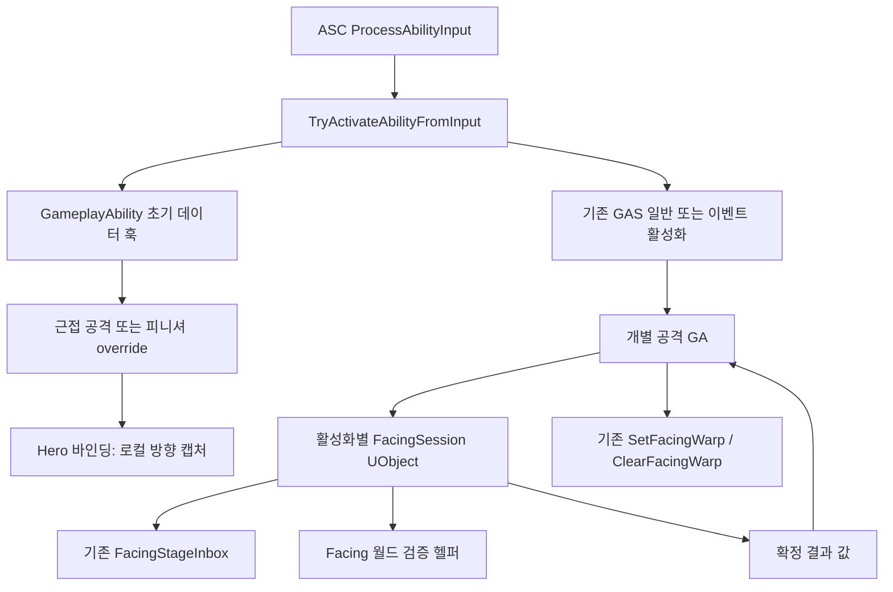

# 록온 Facing 구조 리팩토링 설계

작성일: 2026-09-17  
개정 2: 2026-09-17 — 검토 반영. 선행 수정 3건 분리, 이름 없는 스테이지 버그 확정 처리, 이관 순서 재배열, §6 공백 결정, 태그 작업 가치 재평가.  
개정 3: 2026-09-17 — 코드·엔진 대조 검토 반영. §9-2를 확정 버그에서 방어적 대조로 격하, §5 전방 선언 명시, §11 기준선을 5단계 PIE 검증으로 고정. **이 개정으로 구현 착수.**  
상태: 구현 중. `c3d9ab6`(5단계 PIE 검증 통과)을 기준선으로 한다.  
관련 문서: [5단계 네트워크 설계](lockon-stage-5-network-proposal.md)

## 개정 3 변경 요약

| | 개정 2 | 개정 3 |
|---|---|---|
| §9-2 활성화 키 미대조 | 확정 버그, 선행 수정 | **방어적 대조로 격하.** 엔진 `RemoteEndOrCancelAbility`가 InstancedPerActor 인스턴스의 활성화 키를 대조해 일치할 때만 EndAbility를 부르고(`AbilitySystemComponent_Abilities.cpp:2156`), 로컬 종료 경로는 전부 `CurrentActivationInfo`를 넘긴다. 도달 불가 경로이므로 선행 커밋에서 빼고 이관 단계 7의 `MatchesActivation` + 불일치 시 `ensure`로 관측만 한다 |
| §5 Hero_Base의 제안 타입 | "값 타입을 아는 것은 허용" | **전방 선언으로 한정.** `struct FAstralFacingProposal;` + 값 반환 선언만 헤더에 두고 정의·호출부(.cpp)가 전체 타입을 포함한다. 그래야 §12 "파생 GA가 AstralFacingTypes.h를 전이 include하지 않는다"와 양립한다 |
| §11 기준선 | "호스트/원격 콤보 결과를 기록" | **5단계 PIE 검증(핸드오프 시나리오 0~7)이 기준선.** 검증 완료 확인 후 착수 |
| ComputeFacingToward · 태그 · 헤더 전파 | 주장 | 코드 대조 확인 — 호출부 0 · 태그는 ASC 1곳 인자뿐이며 Config/Content 참조 없음 · 파생 9종 전부 Hero_Base.h 경유로 AstralFacingTypes.h 포함 |

## 개정 2 변경 요약

| | 개정 1 | 개정 2 |
|---|---|---|
| 이름 없는 스테이지 | "모순이 관측되면 별도 버그 수정으로 정의" | **확정 버그.** 재현 경로를 기재하고 선행 수정으로 승격 |
| `ResolveStage` 호출 조건 | "초기에는 현재 호출 조건을 유지한다" | **삭제.** 이름과 무관하게 매 단계 호출, 워프 설치만 이름으로 분기 |
| 죽은 코드 | "ComputeFacingToward는 실제 소비 여부를 확인" | **호출부 0 확정.** 삭제 대상으로 명시 |
| 카운터·End 수정 | 큰 재배치에 포함 | **선행 독립 커밋으로 분리** |
| 이벤트 태그 | BP/애셋 참조 확인 경고 | **순수 명명 작업.** 엔진이 태그로 라우팅하지 않음을 근거로 비중 하향 |
| §6 공백 | "공유할 수 있다", 이름 미정 | **결정됨** — 공유 헬퍼 없음, `AdvanceStage`로 개명 |

## 1. 목적과 범위

현재 UAstralGA_Hero_Base에 모인 Facing 활성화 데이터 작성, 타겟 캡처, 네트워크 세션, 서버 검증, 워프 설치를 책임별로 분리한다.

핵심 결정:
- ASC의 ProcessAbilityInput → TryActivateAbilityFromInput 구조는 유지한다.
- 범용 활성화 데이터 훅은 UAstralGameplayAbility에 유지하고, 구체적인 구현은 근접 공격과 피니셔가 소유한다.
- Facing 네트워크 실행 상태는 두 공격 GA가 활성화마다 생성하는 전용 UObject 세션이 소유한다.
- 타겟 캡처는 히어로 바인딩 헬퍼, 서버 검증은 Facing 도메인 헬퍼, 워프 설치 시점·이름은 개별 GA가 소유한다.
- 새로운 Hero_Attack 공통 상속 계층이나 범용 기능 플러그인 체계는 만들지 않는다.

구조 변경과 플레이 규칙 변경을 분리한다. 이번 리팩토링은 스테이지 시작 캡처, 양자화, 서버 reject/NoWarp, 무대기 몽타주, 기존 충돌 정책을 유지한다. SavedMove 워프 복원이나 새로운 전송 프로토콜을 함께 구현하지 않는다.

**예외 — 알려진 버그 2건은 재배치보다 먼저 고친다.** §9의 이름 없는 스테이지 버그와 활성화 키 미대조 종료다. 구조 이관 뒤에 고치면 증상이 이동 때문인지 원래 있던 버그인지 구분되지 않는다. 기준선에 알려진 버그를 남기지 않는다.

현재 코드는 호스트도 활성화 이벤트 경로를 사용한다. 이번 리팩토링은 이 실제 동작을 유지한다. 과거 설계의 호스트 TryActivateAbility 유지 방침과는 차이가 있음을 기록한다. 호스트 경로를 되돌리는 변경은 별도로 판단한다.

## 2. 현재 구조의 문제

UAstralGA_Hero_Base는 점프·질주·회피·방어·원거리·스타일 전환·패시브까지 파생 9종이 공유하는 클래스다. 그중 Facing을 쓰는 것은 근접 공격과 피니셔 2종뿐이다. 그런데 베이스가 FacingInbox, 구독 핸들, 활성화 키, 활성 상태와 송수신 코드까지 소유한다. UsesFacingWarp=false는 실행만 막으며 의존성과 상태 상속을 제거하지 않는다. 헤더가 AstralFacingTypes.h를 모든 히어로 GA로 전파한다.

AstralGA_Hero_Base.cpp는 475줄이며 그중 약 350줄이 Facing이다.

MakeActivationEventData 자체는 유효한 다형적 확장점이다. 문제는 모든 히어로의 베이스에서 Facing만을 공통 활성화 정책으로 구현하고 있다는 점이다.

ASC는 일반적인 MakeActivationEventData를 호출하면서 GameplayEvent_ActivateWithFacing을 고정한다. 데이터 종류를 몰라야 하는 활성화 경로가 Facing 의미에 묶인다.

현재 MakeActivationEventData의 false는 '일반 활성화 사용'과 'Avatar가 없어 작성 실패'를 동시에 나타낸다.

진단 카운터 Sent는 두 의미로 쓰인다. Stage 0 페이로드 작성 시점(AstralGA_Hero_Base.cpp:151)과 Stage 1~N의 실제 TargetData 송신 시점(:316)이 같은 필드를 증가시킨다.

## 3. 목표 구조



| 위치 | 책임 | 알아서는 안 되는 것 |
|---|---|---|
| ASC | 입력 Spec 선택, 초기 데이터 결과에 따른 활성화 경로 선택 | Facing 타입·타겟·단계·워프 이름 |
| GameplayAbility | 범용 초기 데이터 계약, 얇은 워프 조작 헬퍼 | Facing 수신 보관함·세션 수명 |
| Hero_Base | 자원 헬퍼, 히어로의 로컬 타겟을 방향 제안으로 변환 | 네트워크 구독·활성화 키·세션 상태 |
| 공격 GA | 단계 수·시점·이름, 초기 페이로드 작성, 세션 소유·종료, 결과 적용 | GAS 캐시 소비 세부 구현 |
| FacingSession | 수신 구독·캐시 소비·단계 보관·후속 송신·역할별 확정 | Hero 클래스·TargetingComponent·ComboStages·MotionWarpingComponent |
| Facing 검증 헬퍼 | Avatar와 제안에 대한 서버 월드 검증 | 활성화 수명·워프 설치 |

## 4. 입력 활성화 훅

기존 MakeActivationEventData의 bool 대신 세 가지 결과를 사용한다. 이름과 시그니처는 아래를 구현 목표로 삼는다.

```cpp
enum class EAstralInputActivationPreparation : uint8
{
    Default,        // 기존 TryActivateAbility
    WithEventData,  // 작성한 데이터로 Spec 지정 이벤트 활성화
    Failed          // 작성 실패. 이번 입력으로 일반 활성화에 폴백하지 않음
};

virtual EAstralInputActivationPreparation MakeActivationEventData(
    const FGameplayAbilityActorInfo& ActorInfo,
    FGameplayEventData& OutEventData) const;
```

UAstralGameplayAbility 기본 구현은 Default다. Hero_Base는 이 함수를 override하지 않는다. 근접 공격과 피니셔만 override한다.

훅은 활성화 이전에 호출되므로 CurrentActorInfo·CurrentSpecHandle에 의존하지 않는다. 전달한 ActorInfo와 클래스 설정만 읽는다. primary instance와 CDO 어느 쪽에서도 실행 상태를 변경하지 않고 세션을 생성하지 않는다.

구체 GA의 초기 작성 절차:
1. ActorInfo의 Avatar가 없으면 Failed.
2. Hero 캡처 헬퍼로 Stage 0 제안 작성. 타겟 없음은 유효한 None이며 실패가 아니다.
3. Instigator/Target 및 Facing TargetData를 작성하고 WithEventData 반환.

FacingSession은 초기 이벤트 작성에 관여하지 않는다. 그 시점에는 확정된 활성화 키와 세션 수명이 아직 없다.

### ASC 라우팅

```text
Spec 유효성 확인
→ 실행 전 데이터 작성 훅 호출
→ Default: TryActivateAbility
→ WithEventData: TriggerAbilityFromGameplayEvent(Spec 지정)
→ Failed: 종료 및 진단, 일반 활성화로 재시도하지 않음
```

활성 GA의 콤보 입력은 기존 AbilitySpecInputPressed/WaitInputPress 경로를 유지한다. Failed와 WithEventData 활성화 거부는 일반 활성화로 자동 재시도하지 않는다.

Spec의 PendingRemove/RemoveAfterActivation, ActorInfo/Avatar 등 기존 이벤트 경로 가드는 데이터 작성 전에 가능한 범위에서 수행한다. 일반 활성화의 엔진 가드를 임의로 재구현하거나 기존 Default 경로의 허용 조건을 넓히지 않는다.

### 이벤트 태그 일반화 — 순수 명명 작업

이벤트 태그는 GameplayEvent.Ability.ActivateFromInput으로 일반화한다. 모든 초기 데이터 훅이 현재 하나의 '입력으로 활성화' 의미를 공유하므로 GA별 태그 반환 API는 추가하지 않는다.

**이 변경의 런타임 위험과 값은 모두 낮다.** 근거:

- 현재 태그는 AstralAbilitySystemComponent.cpp:258 한 곳에서 인자로만 쓰이고 읽는 코드가 없다.
- 엔진 TriggerAbilityFromGameplayEvent는 태그로 라우팅하지 않는다. SpecHandle을 직접 받고 태그는 TempEventData.EventTag에 스탬프만 한다(AbilitySystemComponent_Abilities.cpp:2489-2493). AbilityTriggers 경로를 타지 않으므로 BP의 트리거 등록과도 무관하다.

따라서 이 작업은 구조 목표(ASC가 Facing 의미를 모르게 한다)에만 기여하는 명명 정리다. 별도 이관 단계로 두지 않고 활성화 반환 계약 변경과 같은 커밋에 포함한다. 다만 태그 이름 자체를 참조하는 BP/데이터 애셋이 있는지는 커밋 전에 확인한다. 사용처가 있으면 함께 이관하거나 호환 리다이렉트를 적용한다.

## 5. Hero_Base에 남길 것

다음 읽기 헬퍼는 히어로 바인딩 책임과 맞으므로 남긴다.
- ResolveEffectiveTarget
- CaptureFacingProposal(const AActor* Avatar, int32 StageIndex): private에서 protected로 이동
- 기존 자원 적용 헬퍼

CaptureFacingProposal은 Hero의 TargetingComponent 조회, 수평 방향 계산, 양자화, None 생성만 수행한다. RPC·Inbox·통계 송신 카운터·세션 생성은 하지 않는다. StageIndex의 유효 범위는 uint8 변환 전에 확인한다.

UsesFacingWarp, GetFacingStageCount, MakeActivationEventData override와 모든 Facing 세션 필드는 제거한다. Hero_Base가 Facing 제안 값 타입을 아는 것은 허용한다. 히어로 타겟을 제안으로 변환하는 실제 책임에 필요한 의존성이다.

**단, 헤더에는 전방 선언만 둔다** (개정 3). `struct FAstralFacingProposal;` 뒤에 값 반환 선언 `FAstralFacingProposal CaptureFacingProposal(...) const;`만 두고, `AstralFacingTypes.h`는 Hero_Base.cpp와 호출부(공격 GA .cpp)가 포함한다. 비UFUNCTION이라 UHT 제약이 없고 C++에서 불완전 타입의 값 반환 선언은 합법이다. 이렇게 해야 §12의 "파생 GA가 AstralFacingTypes.h를 전이 include하지 않는다"가 성립한다.

### ComputeFacingToward는 삭제한다

호출부가 없다. 5단계에서 방향 적용이 DequantizeYaw 결과로 FRotator를 직접 구성하는 경로로 바뀌면서(AstralGA_Hero_Base.cpp:361) 소비자가 사라졌고, 현재 남은 참조는 선언과 정의뿐이다. 개정 1의 "실제 소비 여부를 확인하고 불필요하면 별도 정리"는 확인 결과 삭제로 확정한다.

AstralTargeting::ClampFacingYaw의 처분은 이 문서의 범위가 아니다. lockon-design.md §5가 순수 함수와 테스트를 유지하기로 결정했으므로 그대로 둔다.

## 6. 활성화별 FacingSession

제안 파일: AbilitySystem/Facing/AstralFacingSession.h/.cpp  
제안 타입: UAstralFacingSession : UObject

### UObject를 선택하는 이유

현재 수신은 AddUObject 델리게이트를 사용한다. 별도 UObject로 이동하면 약한 구독 수명과 기존 Unreal 패턴을 유지할 수 있다. 값 타입에 raw this 람다를 붙이거나 GA에 콜백 전달 함수를 남길 필요가 없다.

더 중요한 이유는 정체성이다. 공격 GA는 InstancedPerActor라 인스턴스가 활성화 간에 재사용되며, 활성화별 정체성을 필드 비교로만 흉내 내고 있다. 활성화마다 별도 객체를 만들면 늦은 콜백과 늦은 종료가 새 활성화를 건드리는 문제를 구조로 막는다.

ActorComponent는 사용하지 않는다. 이 상태의 수명은 Pawn 전체가 아니라 어빌리티 활성화다. AbilityTask도 필수는 아니다. 대기·틱·블루프린트 비동기 출력이 없는 세션에 Task 동작을 추가하지 않는다.

### 소유권

- 근접 공격·피니셔에만 UPROPERTY(Transient) TObjectPtr<UAstralFacingSession>를 둔다.
- CommitAbility와 공격 데이터 가드 통과 후 NewObject로 활성화마다 새 객체를 생성한다. Outer는 해당 GA다.
- 세션 내부에는 ASC/Avatar의 약한 참조, SpecHandle, 원래 ActivationPredictionKey, 단계 수, 역할을 저장한다.
- 키와 단계 수는 Begin 이후 변경하지 않는다. 새 활성화는 기존 객체를 Reset해 재사용하지 않는다.
- End는 멱등이다. 종료 뒤 콜백은 아무 데이터를 소비하거나 설치하지 않는다.
- 객체 파괴에 정리를 맡기지 않는다. EndAbility가 명시적으로 End를 호출한다. BeginDestroy에는 약한 ASC가 아직 유효한 경우의 잔여 구독 해제 안전망만 고려한다.
- Tick 및 복제는 없다.

### 제안 API

```cpp
bool Begin(const FAstralFacingSessionContext& Context,
           const TOptional<FAstralFacingProposal>& StageZero);

// 단계 경계에서 1회. 이름이 AdvanceStage인 이유는 §6 '부수효과' 참조
FAstralFacingStageResolution AdvanceStage(
    int32 StageIndex,
    const TOptional<FAstralFacingProposal>& LocalProposal);

void End();
bool MatchesActivation(FGameplayAbilitySpecHandle Handle,
                       const FPredictionKey& Key) const;
```

Context에는 ASC, Avatar, SpecHandle, ActivationKey, NumStages, 역할 구분만 둔다. 역할은 현재와 같이 로컬 실행과 원격 서버 승인 실행으로 구별하며 Simulated Proxy는 세션을 시작하지 않는다. 공격 GA 포인터나 워프 이름은 필요하지 않다.

결과 값 FAstralFacingStageResolution에는 StageIndex, Decision, RejectReason, 선택된 Proposal을 둔다. WarpTargetName은 넣지 않는다. Warp가 아니면 Proposal의 Yaw를 실행에 사용하지 않는다.

### 부수효과 — 개정 1의 ResolveStage를 AdvanceStage로 개명한다

이 함수는 결정만 하지 않는다. 원격 소유 클라이언트에서는 CallServerSetReplicatedTargetData 송신이 일어나고, 모든 역할에서 Inbox의 단계 경계가 전진한다. Resolve라는 이름은 순수 조회처럼 읽혀 호출 위치와 횟수를 잘못 판단하게 만든다.

송신을 별도 함수로 분리하는 안은 채택하지 않는다. "한 단계에서 정확히 1회"라는 계약이 두 함수에 걸치면 호출자가 순서와 짝을 맞춰야 하고, 중복 호출 방지가 어려워진다. 단일 함수가 전진·송신·확정을 원자적으로 소유하고, 이름이 그 사실을 드러내는 쪽을 선택한다.

세션은 AdvanceStage가 한 단계에서 한 번이라는 계약을 소유한다. 중복 호출에 대해서 이전 결과를 반환하고 재송신·재결정하지 않는다. 소비자도 몽타주 시작 시 1회 호출한다. 이는 재배치와 구분되는 계약 보강이며 별도 테스트/커밋으로 확인한다.

### Stage 0 준비 — 공유 헬퍼를 만들지 않는다

개별 GA가 TriggerEventData에서 기존 ExtractProposal로 Stage 0을 추출한다. 로컬 실행에서 데이터가 없으면 Hero 캡처 헬퍼로 폴백하고, 원격 서버는 폴백하지 않는다. 결과를 Begin에 전달한다.

개정 1이 열어둔 "작은 준비 헬퍼로 공유할 수 있다"는 채택하지 않는다. 공유 헬퍼는 역할 구분과 캡처 콜백을 모두 인자로 받아야 하므로, 두 GA에 남는 약 6줄의 중복보다 결합이 크다. §7의 "워프 결과 적용의 if/else 중복을 허용한다"와 같은 판단이다.

ExtractProposal은 TargetData 타입의 정적 함수이므로 GA가 직접 호출해도 Hero·TargetingComponent 의존이 생기지 않는다.

Begin은 StageZero를 Inbox에 넣고 원격 서버 수신기를 등록한 뒤 등록 전 캐시를 회수한다. Stage 0은 별도 TargetData RPC로 다시 보내지 않는다. 기존 단발 공격의 수신기 동작도 우선 유지한다. 단발 수신 구독 제거는 구조 이관과 분리해 최적화한다.

### AdvanceStage 동작

- 로컬 Stage 0: Begin에 전달한 값 사용, 재캡처·재전송 없음.
- 로컬 Stage 1~N: GA가 단계 직전 캡처해 인자로 전달. 세션이 원격 클라이언트일 때만 송신한다.
- 원격 서버: LocalProposal을 사용하지 않고 Inbox에서만 결정한다. 값이 전달되면 진단한다.
- 서버 검증은 Facing 검증 헬퍼에 위임한다.
- 결과만 반환하며 워프 설치·제거·몽타주 재생은 하지 않는다.
- **워프 이름 유무와 무관하게 호출된다.** 근거는 §9.

### 수신과 종료

콜백은 해당 세션 객체가 저장한 ASC와 키만 사용한다. GA의 변할 수 있는 CurrentActorInfo를 다시 읽지 않는다.

1. 세션 활성 상태 확인.
2. 수신 핸들을 로컬 복사.
3. 자신이 구독한 키의 GAS 캐시 소비.
4. 기존 ExtractProposal과 FacingStageInbox.Receive로 분류.

End는 비활성 표시 → 자신의 델리게이트 해제 → 자신의 키 캐시 소비 → Inbox 정리 순서다. 다른 활성화의 캐시를 소비하지 않는다.

GA EndAbility에서 전달된 Handle/ActivationInfo의 키가 현재 보유 세션과 일치할 때만 End와 포인터 해제를 수행한다(MatchesActivation). 일치하지 않는 종료가 새 세션 또는 새 활성화의 워프 이름을 지우지 않도록 기존 워프 정리 경로도 함께 확인한다. 객체 분리 자체만으로 모든 재진입 문제가 해결됐다고 간주하지 않는다.

## 7. GA에 남는 오케스트레이션

```cpp
// 개념적 호출 흐름. 세부 엔진 인자와 선언은 구현 시 확정한다.
ActivateAbility(...)
{
    // 기존 CommitAbility / 데이터 가드
    // Stage 0 추출 또는 허용된 로컬 폴백
    FacingSession = NewObject<UAstralFacingSession>(this);
    FacingSession->Begin(Context, StageZero);
    PlayComboStage(0);
}

PlayComboStage(StageIndex)
{
    // 기존 콤보·몽타주 태스크 정리
    // Stage 0 제외, 로컬 실행만 지금 캡처
    const auto Result = FacingSession->AdvanceStage(StageIndex, LocalProposal);

    // 워프 이름이 있는 단계만 설치/제거한다. AdvanceStage 호출은 위에서 이미 끝났다
    if (!Stage.FacingWarpTargetName.IsNone())
    {
        // Warp이면 SetFacingWarp, 아니면 ClearFacingWarp
    }

    // 기존 몽타주 재생
}

EndAbility(...)
{
    // MatchesActivation이 참일 때만 세션 End / 포인터 해제
    // 기존 소유 이름 정리
    // Super::EndAbility
}
```

피니셔는 Begin의 NumStages에 1을 전달한다. 근접 공격은 ComboStages.Num()을 전달한다. GetFacingStageCount 가상 함수는 불필요하다.

워프 결과 적용의 if/else가 두 GA에 몇 줄 중복되는 것은 허용한다. 이를 없애려고 네트워크 결과 타입을 공통 GameplayAbility까지 끌어올리지 않는다. 기존 SetFacingWarp/ClearFacingWarp를 그대로 재사용한다.

## 8. 검증 헬퍼와 진단

ValidateFacingProposal은 Hero_Base에서 AbilitySystem/Facing의 월드 검증 함수로 이동한다. 인자는 Avatar와 Proposal이며 CurrentActorInfo를 읽지 않는다. 기존 CanDamage, 2D 거리, ValidateBearing과 상수값을 유지한다. 거리 차원 변경·튜닝값 데이터화·새 검증 추가는 이번 리팩토링에 섞지 않는다.

기존 AstralFacingTypes의 Proposal, 직렬화, Inbox와 순수 계산은 재사용한다. 파일 분할 자체를 위한 전면 재배치는 하지 않는다.

드롭·중복 테스트 훅과 프로세스 전역 통계는 Facing 전용 진단 파일로 옮긴다. Hero_Base에 콘솔 명령과 매크로를 남기지 않는다.

### 카운터 의미 분리 (선행 수정)

현재 Sent는 Stage 0 페이로드 작성(:151)과 Stage 1~N 실제 송신(:316) 양쪽에서 증가해 두 의미가 섞여 있다. 다음으로 나눈다. 이 수정은 구조 이관과 무관하므로 선행 커밋으로 처리한다.

- 초기 페이로드 작성은 Prepared로 센다. Sent라고 부르지 않는다.
- 후속 CallServerSetReplicatedTargetData 호출은 TargetDataSendAttempts로 센다.
- Stage 0은 Prepared와 서버 수신·활성화 로그를 대응시킨다. 실제 GAS 송신을 가로채는 새 계측은 만들지 않는다.
- 기존 콘솔 명령 이름은 유지한다. DropSendStage=0의 WithEventData + 빈 데이터 동작과 로컬 캡처 폴백을 보존한다.
- 결정 로그의 몽타주 위치·워프 이름·PawnCollisionPolicy는 적용 시점의 GA 진단에서 수집한다. 세션은 이를 위해 CMC나 AnimInstance에 의존하지 않는다.

## 9. 선행 수정 — 알려진 버그 2건

구조 이관 전에 닫는다. 이관 후에 발현하면 증상이 재배치 때문인지 원래 있던 버그인지 구분되지 않는다.

### 9-1. 워프 이름이 없는 스테이지가 Inbox 단계 진행을 끊는다 (확정)

개정 1은 이를 "모순이 관측되면 별도 버그 수정으로 정의한다"로 미뤘다. 코드 확인 결과 조건이 성립하면 **결정적으로 발생**한다.

AstralGA_Hero_BasicAttack_Melee.cpp:307-310은 워프 이름이 있을 때만 ResolveFacingForStage를 호출한다. 그런데 FacingInbox.BeginStage(StageIndex)가 그 함수 안에 있고, FAstralFacingStageInbox::BeginStage는 요청 단계가 현재 단계+1이 아니면 슬롯을 비우고 false를 반환한다.

```
스테이지 1의 FacingWarpTargetName이 비어 있음
  → BeginStage(1) 미호출. Inbox의 CurrentStage는 0에 정지
  → 스테이지 2에서 BeginStage(2) 호출 → 2 != 0+1 → 단계 불일치
  → 슬롯 초기화. 정상 도착한 스테이지 2 제안이 폐기되고 NoWarp_Missing
  → 이후 모든 단계가 같은 사유로 어긋난다
```

클라이언트도 같은 분기를 쓰므로 그 단계의 TargetData 송신 자체가 빠진다. 서버 보관함이 한 칸 어긋난 상태로 남는다.

현재 데이터(Tools/data/facing_warp.json, Tools/scripts/lockon_setup_facing_data.py)는 네 몽타주 전부 워프 이름이 있어 발현하지 않는다. 그러나 FAstralComboStageData.FacingWarpTargetName의 주석은 "비워 두면 이 스테이지는 보정 없음"이라고 빈 이름을 합법으로 선언한다. 데이터 한 칸으로 터지는 상태다.

**수정**: 단계 전진·송신·확정(현 ResolveFacingForStage, 이관 후 AdvanceStage)은 워프 이름과 무관하게 매 단계 호출한다. 이름 유무로 분기하는 것은 SetFacingWarp/ClearFacingWarp 호출뿐이다. 이름 없는 단계는 방향 보정만 없고 단계 진행과 서버 동기화는 정상적으로 유지된다.

이 수정은 이관 전 현재 구조에서 먼저 적용할 수 있다. Melee.cpp의 호출 조건과 Hero_Base.cpp의 워프 적용 분기만 건드린다.

### 9-2. EndFacingSession의 활성화 키 대조 — 방어적 대조로 격하 (개정 3)

개정 2는 "이전 활성화의 지연된 EndAbility가 새 활성화의 세션을 철거할 수 있다"를 확정 버그로 봤다. 엔진 대조 결과 **도달 불가 경로**다.

- 원격 종료(`ServerEndAbility`/`ClientEndAbility`)는 `RemoteEndOrCancelAbility`가 InstancedPerActor 인스턴스의 `GetCurrentActivationInfoRef().GetActivationPredictionKey()`와 수신 키를 비교해 일치할 때만 EndAbility를 부른다 (`AbilitySystemComponent_Abilities.cpp:2156`).
- 로컬 종료 경로(OnMontageCompleted/Interrupted, CommitAbility 실패)는 전부 `CurrentActivationInfo`를 넘기므로 키가 항상 현재 활성화와 같다.
- 프로젝트 코드가 옛 ActivationInfo를 보관했다가 나중에 EndAbility를 부르는 곳은 없다.

설령 도달한다 해도 Melee의 EndAbility가 ComboIndex·태스크를 무조건 리셋하므로 세션 키만 대조해서는 반쪽 방어다.

**처리**: 선행 버그 수정에서 제외한다. 이관 단계 7에서 `MatchesActivation`으로 대조하고, 불일치 시 `ensureMsgf`로 관측한다 — 세션은 종료하지 않고 다음 활성화가 포인터를 교체하며 `BeginDestroy` 안전망이 잔여 구독을 해제한다. 기존 워프 이름 정리(`ClearFacingWarps`)는 그대로 무조건 수행한다 — 동작 변경 없음.

## 10. 파일별 변경 계획

| 파일 | 변경 |
|---|---|
| AstralGameplayAbility.h | 초기 데이터 결과 enum과 기본 훅 계약 |
| AstralAbilitySystemComponent.cpp | 결과별 라우팅, Facing 태그 의존 제거 |
| AstralEventGameplayTags.h/.cpp | 입력 활성화용 일반 이벤트 태그 및 호환 처리 |
| Hero/AstralGA_Hero_Base.h/.cpp | 세션 구현·상태·override 제거, 캡처 헬퍼만 유지, ComputeFacingToward 삭제 |
| Facing/AstralFacingSession.h/.cpp | 활성화별 네트워크 세션 |
| Facing/AstralFacingValidation.h/.cpp | 기존 월드 검증 이동 |
| Facing/AstralFacingDebug.h/.cpp | 진단·테스트 훅 이동, 카운터 의미 분리 |
| BasicAttack_Melee.h/.cpp | 훅 override, 세션 포인터, 단계 호출 이관, 이름 무관 호출 |
| MarkFinisher.h/.cpp | 훅 override, 세션 포인터, 단발 호출 이관 |
| Tests/AstralFacingTests.cpp 및 필요한 통합 테스트 | 기존 테스트 유지, 계약 보강 |

새 파일명은 제안이다. Build.cs 의존 추가는 원칙적으로 필요하지 않다. 같은 런타임 모듈 안에서 이관한다.

## 11. 이관 순서

각 항목이 독립 커밋이며 그 단위로 검증한다.

| | 작업 | 성격 |
|---|---|---|
| 1 | `c3d9ab6` 기준 5단계 PIE 검증(핸드오프 시나리오 0~7, Listen + Separate Process, `net.PktLag 150`) 통과 확인 + Facing 테스트 8/8 | 기준선 (개정 3: 완료 확인됨) |
| 2 | ComputeFacingToward 삭제 | 죽은 코드 |
| 3 | 진단 카운터 Prepared/TargetDataSendAttempts 분리 (§8) | 진단 정확도 |
| 4 | 이름 없는 스테이지 수정 (§9-1) | **버그 수정** |
| 5 | ~~활성화 키 대조 종료 (§9-2)~~ → 개정 3에서 단계 7의 `MatchesActivation` + `ensure` 관측으로 흡수 | 방어적 대조 |
| 6 | 세션 UObject·검증·진단 헬퍼 추출. 임시로 Hero_Base가 위임해도 되지만 최종 구조로 남기지 않는다 | 순수 이동 |
| 7 | 근접 공격·피니셔로 세션 소유권 및 초기 데이터 override 이관. Begin/End가 있는 모든 종료 경로 확인. 키 불일치는 `ensure`로 관측 | 순수 이동 |
| 8 | Hero_Base의 UsesFacingWarp/GetFacingStageCount/세션 필드 제거. 잔여 참조 검색 | 순수 이동 |
| 9 | 활성화 반환 3분기 + 이벤트 태그 일반화 (§4) | 계약 변경 |
| 10 | 중복 AdvanceStage 방지 등 계약 보강을 독립 검증 | 계약 보강 |
| 11 | 회귀 검증 후 임시 어댑터 제거, 설계 문서와 코드 주석 정합 | 마무리 |

2~5를 6보다 앞에 두는 이유는 기준선에 알려진 버그를 남기지 않기 위해서다. 이관 후에 증상이 나오면 재배치 때문인지 원래 있던 버그인지 구분되지 않는다.

4·5에서 발견된 다른 런타임 버그는 별도 변경으로 기록하고 이 순서에 끼워 넣지 않는다.

이 문서는 M1 및 5단계 전체 완료를 선언하지 않는다. 구조 검증과 네트워크 기능 완료 조건은 별개다.

## 12. 완료 기준

구조:
- ASC에는 Facing 타입·전용 태그·UsesFacingWarp 분기가 없다.
- Hero_Base에는 Inbox·델리게이트·활성화 키·세션 포인터·네트워크 통계가 없다. ComputeFacingToward도 없다.
- 점프·질주·회피·방어·원거리·스타일 전환·패시브는 세션 객체를 생성하지 않으며 AstralFacingTypes.h를 전이 include하지 않는다.
- FacingSession에는 Hero 클래스, TargetingComponent, 몽타주 배열, 워프 설치 API 의존이 없다.
- 세션 객체는 공격 활성화마다 분리되고 종료 후 구독이 남지 않는다.

검증:
- 기존 AstralFacingTests 및 프로젝트 관련 Automation 테스트 통과.
- Default / WithEventData / Failed 라우팅, 데이터 훅 실패 후 일반 활성화 미실행 확인.
- 초기 데이터 작성이 세션 생성·GA 상태 변경을 일으키지 않음 확인.
- Stage 0 동일 양자화값 사용, 후속 단계 시작 캡처, 명시적 None·DropSendStage·DuplicateSend 유지.
- **콤보 스테이지 중 하나의 FacingWarpTargetName을 비운 상태에서, 그 단계만 무보정이고 이후 단계는 정상 승인·보정된다** (§9-1 회귀 방지). 서버 로그에 단계 불일치가 찍히지 않아야 한다.
- **이전 활성화의 지연된 EndAbility가 새 활성화의 세션·워프를 철거하지 않음** (§9-2). 연속 취소·재활성화로 확인.
- 조기 데이터 소비, 단계 중복 AdvanceStage의 재송신 방지, End 멱등성 검증.
- Listen Separate Process에서 호스트·원격의 기본 공격/피니셔, 활성화 실패, 취소·재시작을 확인.
- 미사용 GA의 점프·질주·방어·원거리 기본 활성화가 기존 경로를 유지.
- 적 Pawn 접촉 공격과 보정 재실행에서 리팩토링 전 대비 회귀 없음. 새 워프 복원 알고리즘을 넣어 결과를 혼합하지 않음.

소규모 순수 함수 테스트만으로 UObject 구독·GC·GAS 활성화 경로가 검증됐다고 보지 않는다. 실제 월드/멀티플레이 경로를 필요한 범위에서 확인한다.

## 13. 설계 결론

범용 활성화 훅은 유지한다. Facing을 쓰는 구체 GA가 그 훅의 의미를 정의하고 세션을 소유한다. Hero_Base는 히어로 데이터 조회만 지원하며, 세션은 네트워크 수명과 단계 결정을 담당한다. 실제 워프 이름·설치·몽타주 시작은 기존처럼 개별 GA가 결정한다.

알려진 버그 2건은 이 재배치의 일부가 아니라 선행 조건이다. 구조 작업의 성공 여부를 판정할 수 있는 기준선을 먼저 만든다.
