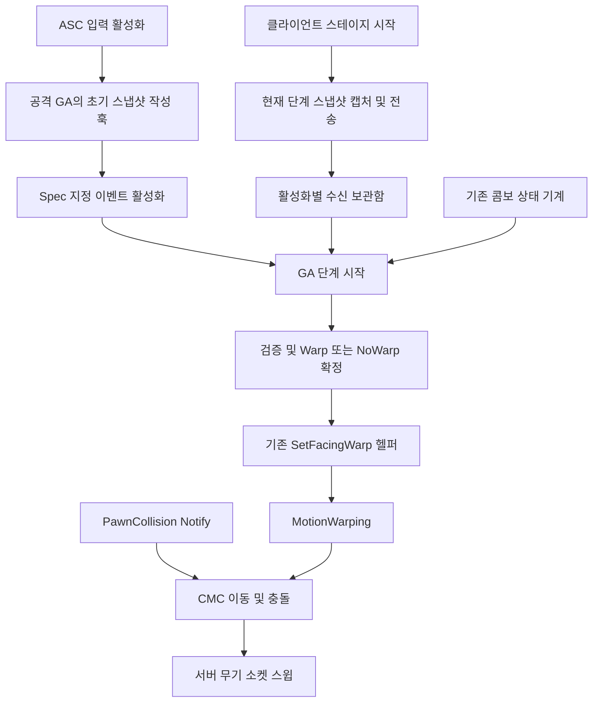

# 록온 5단계 — 공격 방향의 네트워크 정합 설계안

작성일: 2026-09-14  
상태: 구현 전 제안. 런타임 검증 결과가 아닌 설계 계약이다.  
개정 2: 검토 반영 — 스테이지 시작 캡처 복원, 호스트 활성화 경로 유지, M1 선행 조건 및 저작 검증 접점 명시.  
기준: 현재 AstralBreak 작업 트리와 UE 5.7.4 로컬 소스. 기존 미커밋 Pawn 충돌 정책을 포함한다.  
원본: `C:/Users/KMY96/.claude/plans/lockon-stages/stage-5-network.md`

## 1. 목표와 보장 범위

원격 플레이어의 근접 콤보와 표식 피니셔가 공격별로 캡처한 동일한 방향값을 클라이언트 예측과 서버 실행에 사용한다. 실제 적중·데미지는 기존 서버 AttackTraceWindows가 결정한다.

정상적으로 기한 안에 승인된 데이터에 대해서 방향 스냅샷을 일치시킨다. 동일한 목표 Yaw만으로 위치·접촉·몽타주 상태 전체의 결정론이 보장된다고 가정하지 않는다. Pawn 접촉과 보정 재실행까지 측정한다.

데이터 누락·지각·검증 거부 때에는 서버가 해당 단계의 무보정을 확정하고 공격은 계속한다. 이 경우 예측과의 차이 및 일시적인 CMC 보정은 허용하지만, 반복 보정·이전 공격 데이터의 재사용·콤보 정지는 허용하지 않는다.

이번 범위:
- BasicAttack_Melee의 전 단계, MarkFinisher의 단발 공격.
- Stage 0 이벤트 데이터 전달, 후속 단계 TargetData 전달·소비·검증.
- 원격 플레이어 워핑 게이트 전환, 보정 재실행 검증 및 필요한 복원 구현.
- 기존 Pawn 충돌 정책과의 통합 검증.

범위 밖: 카메라 변경, 상시 타겟 복제, SoftTracking, 원거리·회피 연동, 이동 입력 방향 보조, 위치 워핑, 서버 리와인드.

## 2. 핵심 결정

| 항목 | 결정 |
|---|---|
| Stage 0 | 해당 AbilitySpec만 대상으로 GameplayEventData를 포함해 활성화 |
| 후속 단계 캡처 | 각 스테이지 시작 직전. 기존 조작 규칙 유지 |
| 후속 단계 전달 | 현재 활성화 키로 ServerSetReplicatedTargetData |
| 단계 시작 | 서버 콤보 상태 기계가 단독 결정 |
| 방향 확정 | 몽타주 재생 요청 직전 Warp / NoWarp를 1회 확정 |
| 조기 수신 | 다음 한 단계만 보관. 수신으로 콤보를 전진시키지 않음 |
| 지각 수신 | 이미 방향이 확정된 단계에는 적용하지 않음 |
| 서버 검증 실패 | NoWarp. 서버에서 Yaw를 수정해 새 방향을 만들지 않음 |
| 승인 Yaw | 양쪽 모두 동일한 uint16 복원값 사용 |
| 단계 번호 | 활성화 내 ComboIndex. 피니셔는 0 |
| 활성화 구분 | GAS SpecHandle + 원래 ActivationPredictionKey |
| Pawn 충돌 정책 | 기존 Notify 기반 실행 + SavedMove 재실행 경로 유지 |

### 캡처 시점은 유지하고 지각률을 먼저 측정한다

현재 코드처럼 각 스테이지 시작 직전에 타겟과 방향을 읽는다. 콤보 예약 입력 후 분기까지의 타겟 이동·락온 변경도 다음 타에 반영된다. Stage 0은 입력 활성화 직전 캡처하고 후속 타는 PlayComboStage의 시작 경계에서 캡처한다.

원격 서버도 클라이언트보다 늦게 몽타주를 시작하므로, 클라 경계 캡처라는 이유만으로 모든 데이터가 서버 경계에 늦는다고 단정하지 않는다. 실제 수신 시점과 서버 단계 시작 시점의 차이를 측정한다. 지각 시 해당 단계는 NoWarp이고 콤보는 계속된다.

예약 입력 시점 캡처는 채택하지 않는다. 지각률이 실제 문제로 확인된 뒤에만 조작감 비용을 포함한 대안으로 재검토한다. 무대기·경계 스냅샷·지각 시 무보정을 유지하므로 모든 지연 조건에서 무오차를 보장하지는 않는다.

## 3. 책임과 배치



- ASC: 기존 입력 활성화 흐름 유지, opt-in GA의 초기 이벤트 전달만 지원. 타겟 선정·공격별 각도 정책을 알지 않는다.
- 개별 공격 GA: 캡처 시점, 단계 번호, 서버 검증 파라미터, 워프 이름, 단계 확정·종료 소유.
- 공유 값 타입/헬퍼: 페이로드 인코딩·디코딩, 수신 분류, 제한된 보관, 검증 계산. 공통 GA에 불필요한 실행 상태를 추가하지 않는다.
- 기존 GameplayAbility 워프 헬퍼: 검증이 끝난 이름·방향을 설치/제거. 네트워크 수신이나 타겟 재조회는 하지 않는다.
- TargetingComponent: 계속 로컬 전용. 서버 GA는 서버의 TargetingComponent를 조회하지 않는다.
- CMC: 이동·충돌·보정 재실행. 콤보 진행이나 타겟 승인 소유자가 아니다.

후속 TargetData 수신 공통화가 필요하면 공격 GA가 소유하는 작은 수신 객체/태스크를 사용한다. 이는 네트워크 구독 수명을 위한 것이며 MotionWarping 밴드를 재구현하는 태스크가 아니다.

## 4. 전송 계약

아래 이름은 제안이다. 실제 엔진 타입 선언과 직렬화는 구현 단계에서 완성한다.

```cpp
enum class EAstralFacingSource : uint8
{
    None,       // 명시적인 무보정
    LockOn
};

struct FGameplayAbilityTargetData_AstralFacing : FGameplayAbilityTargetData
{
    TWeakObjectPtr<AActor> TargetActor;
    FName TargetPointId = NAME_None;
    uint8 StageIndex = 0;
    uint16 QuantizedDesiredYaw = 0;
    EAstralFacingSource Source = EAstralFacingSource::None;
};
```

- 페이로드는 정확히 1개, 예상 ScriptStruct만 수용한다.
- GetScriptStruct, NetSerialize, WithNetSerializer를 구현하고 라운드트립 테스트를 둔다.
- Actor는 UPackageMap 경로로 직렬화한다. 메모리 주소를 전송하지 않는다.
- 현재 TargetPointId는 NAME_None만 허용한다. 미지원 Source는 거부한다.
- None은 빈 Actor·None 부위·0 Yaw로 정규화한다. 유효한 NoWarp 요청도 매 단계 명시적으로 보낸다.
- 방향 없음과 패킷 미수신은 내부 상태에서 구별한다.
- 워프 이름·몽타주·PlayRate·정책 수치는 서버의 공격 데이터에서만 읽는다.
- StageIndex는 0부터 증가하고 래핑하지 않는다. 기존 ValidateComboStageMontages에 단계 수 1~256 검증을 추가하고, 잘못된 범위는 런타임 시작 가드에서도 거부한다. 기존 워프 이름 중복 및 Facing/PawnCollision 밴드 검증을 재사용한다. 피니셔는 기존 AstralAttackMontage 검증 호출에서 같은 밴드 규칙을 유지한다.

### 방향 생성

1. GA가 해당 공격의 로컬 유효 타겟을 읽는다.
2. 없는 경우 None을 생성한다.
3. 있는 경우 아바타 위치에서 타겟 조준점까지의 수평 Yaw를 캡처한다.
4. uint16로 양자화한다.
5. **로컬 예측도 이 uint16을 역변환한 방향을 사용한다.**

5단계는 현재 런타임 동작을 유지해 추가 MaxAssistYaw 제한을 도입하지 않는다. ClampFacingYaw가 실제 호출되지 않는 현재 상태를 명시적으로 따른다. 공격별 회전 상한 도입은 별도 변경으로 취급하며, 이후 도입 시 양자화 이전의 로컬 정책 단계에 둔다.

## 5. Stage 0 — 이벤트 데이터로 활성화

ASC의 기존 InputTag → Spec 선택, InputPressed 설정, CanActivate/Commit 의미를 유지한다. 아래 이벤트 경로는 원격 소유 클라이언트에 적용한다. 호스트/Standalone은 기존 TryActivateAbility를 유지한다.

1. 비활성 opt-in GA의 초기 페이로드 작성 훅을 호출한다. 이 훅은 읽기만 하며 CDO/GA에 pending 실행 상태를 저장하지 않는다.
2. FGameplayEventData.TargetData에 Stage 0을 넣는다. 타겟이 없어도 명시적 None을 넣는다.
3. 선택한 SpecHandle을 대상으로 TriggerAbilityFromGameplayEvent 경로를 사용한다. 광역 GameplayEvent 방송으로 같은 태그의 여러 GA를 동시에 활성화하지 않는다.
4. 원격 소유 클라이언트와 그 서버 인스턴스의 ActivateAbility는 동일 이벤트 페이로드를 읽는다. 서버에서는 검증한다.
5. 단계 방향을 확정하고 워프를 설치한 뒤 PlayMontageAndWait를 시작한다.

기존 GA의 CommitAbility 실패 처리는 유지한다. 공격 비용을 이미 지불한 상태에서 Facing 검증만 실패하면 공격은 NoWarp로 계속한다. 원격 활성화에서 이벤트 데이터가 누락돼도 서버 로컬 타겟 조회로 보충하지 않는다.

활성 상태인 기본 공격의 추가 입력은 기존 AbilitySpecInputPressed/WaitInputPress 경로를 유지한다. Stage 0 이벤트 활성화를 다시 호출하지 않는다. opt-in하지 않은 GA는 기존 TryActivateAbility를 유지한다.

표식 피니셔도 같은 Stage 0 경로를 쓴다. 후속 단계 수신기는 필요하지 않다.

호스트/Standalone의 ActivateAbility는 로컬이면서 권위인 경우에만 기존처럼 방향을 직접 캡처하고 공통 확정·설치 경로를 사용한다. 네트워크 입력용 거리·각도 거부를 호스트에 새로 적용하지 않는다. 양자화·복원은 공통으로 적용하며 작은 정밀도 변화는 회귀 검증한다. 원격 서버 인스턴스의 이벤트 누락은 이 로컬 폴백에 진입할 수 없다.

### 기본 GAS RPC 배칭을 선택하지 않는 이유

UE 5.7.4 기본 배칭은 서버에서 활성화 후 TargetData를 처리한다. 본 설계는 ActivateAbility에서 데이터를 확보하고 몽타주 재생 요청 전에 설치한다는 계약을 선택하므로 이벤트 경로를 사용한다.

이벤트 경로의 PredictionKey 생성, 활성화 거부, 입력 상태, BP 파생 ActivateAbility 호출은 첫 구현 검증 항목이다. 이벤트 전용 GA를 새로 복제하거나 엔진 소스를 수정하지 않는다.

## 6. 후속 단계 — 스테이지 시작 캡처와 전송

### 클라이언트

기존 콤보 상태 기계가 전진을 결정하고 ComboIndex를 증가시킨 뒤, PlayComboStage에서 몽타주를 재생하기 직전에:

1. 현재 단계의 데이터가 유효한지 확인한다.
2. StageIndex = ComboIndex로 현재 타겟의 스냅샷을 한 번 생성한다.
3. 원격 소유 클라이언트는 ServerSetReplicatedTargetData로 보낸다. 호스트는 전송하지 않는다.
4. 같은 스냅샷으로 로컬 방향을 확정·설치한 뒤 몽타주를 재생한다.
5. 서버는 자기 단계 시작 시 이미 수신한 제안을 소비한다. 없으면 NoWarp를 확정한다.

OnComboInputPressed와 기존 상태 기계의 입력 반환 계약은 변경하지 않는다. 예약 시점에는 방향을 캡처하지 않는다. Stage 0은 활성화 페이로드를 사용하므로 이 경로에서 중복 캡처·전송하지 않는다.

기존 WaitInputPress의 내부 복제 이벤트와 TargetData의 도착 순서에 정확성 보장을 맡기지 않는다. Facing은 콤보 예약 권한이 아니며 콤보 입력이 없어도 도착할 수 있다.

### 서버 수신과 보관

현재 활성화 키에 대해 수신기를 1회 등록한다. 등록 전 도착한 캐시도 확인한다. 콜백에서 핸들을 로컬로 복사한 후 GAS 캐시를 소비하고 프로젝트 보관함에 반영한다. 새 데이터가 이전 GAS 캐시를 덮어쓰는 것을 큐로 오해하지 않는다.

보관함은 현재 단계의 확정 결과와 다음 한 단계 pending으로 제한한다. 서버와 클라이언트의 단계가 2개 이상 벌어진 경우는 정상 버퍼 확장으로 감추지 않고 불일치로 기록한다.

| 조건 | 처리 |
|---|---|
| 활성화 종료/다른 활성화 키 | 적용 금지 |
| 과거 단계 | 폐기 |
| 현재 단계가 이미 확정 | 중복/지각 폐기 |
| 현재 단계 확정 전 | 구조 검증 후 보관 |
| 다음 단계 | 구조 검증 후 보관 |
| 그보다 먼 미래 또는 공격 데이터 범위 밖 | 폐기 |
| 동일 단계의 동일 데이터 재수신 | no-op |
| 동일 단계의 상충 데이터 재수신 | 첫 수용값 유지, 충돌 기록 |

구조 검증을 통과한 첫 데이터가 해당 단계의 제안이다. 미래 데이터의 타겟 생존·거리 등 월드 검증은 단계 시작 때 다시 수행한다. 데이터 수신으로 TryAdvanceCombo를 호출하지 않는다.

### 단계 시작의 단일 확정 지점

PlayComboStage의 몽타주 시작 직전 공통 경로에서:

```text
방향 미확정
  ├─ 유효 제안 + 서버 검증 성공 → Warp(이름, 복원 Yaw)
  ├─ 명시적 None              → NoWarp(ExplicitNone)
  ├─ 미수신                  → NoWarp(MissingAtStart)
  └─ 검증 실패               → NoWarp(Rejected)
       ↓
그 단계에서 다시 변경하지 않음
       ↓
몽타주 재생
```

기한은 벽시계 타이머가 아니라 **몽타주 재생 요청 직전**이다. 늦게 받은 방향을 밴드 중간에 끼워 넣지 않는다. 이전 활성화의 같은 이름이 남아 있을 가능성에 대비해 해당 단계의 NoWarp 확정은 자신이 소유한 그 이름을 제거한다.

## 7. 서버 검증과 실패 처리

### 구조 검증

활성화 키, 페이로드 개수/타입, Source, StageIndex 범위, TargetPointId, None 정규화를 확인한다. 신뢰하지 않은 클라이언트 값으로 배열 인덱스·몽타주·워프 이름을 직접 결정하지 않는다.

### LockOn 월드 검증

- TargetActor가 현재 월드에서 유효하며 자기 자신이 아님.
- CanDamage(Avatar, Target)가 참.
- 거리 제한은 공격 데이터가 소유한다. 현재 록온 유지 반경 2000cm와 네트워크 허용 여유를 기준으로 초기값을 잡는다. 무기 적중 사거리를 이 값으로 대체하지 않는다.
- 제출 Yaw와 서버가 보는 타겟 방위의 최단각 차이가 허용 오차 이내인지 확인한다. 서버 방위는 **검증에만** 사용한다.
- 매우 가까워 방위가 불안정한 구간은 별도 거리 임계로 각도 검증을 완화한다.
- 캡처 후 네트워크 지연을 고려해 각도 오차·거리 여유를 데이터화하고 로그로 튜닝한다.

튜닝 시작값 제안: ValidateRange 2200cm, MaxTargetBearingError 60도, BearingCheckMinDistance 100cm. 이는 검증된 밸런스 수치가 아니다. 정상 이동 타겟과 입력 창 끝 예약에서 거부율을 측정해 확정한다.

카메라 획득 반각 75도를 서버 캐릭터 전방 기준으로 재사용하지 않는다. 하드 록온은 뒤쪽 타겟도 유지할 수 있으며 서버는 로컬 카메라 정책을 재현하지 않는다.

LOS는 이번 승인 조건에 추가하지 않는다. 현재 록온의 LOS 유예와 서버 시점 차이를 별도 프로토콜 없이 엄격하게 재검사하면 정상 요청을 거부할 수 있다. 실제 스윕과 이동 충돌은 기존대로 유지한다.

### 승인/거부

- 승인: 제출 uint16을 그대로 복원해 실행. 서버가 타겟 방향으로 재조준하지 않는다.
- 거부/누락: NoWarp로 확정. 공격 취소·콤보 리셋·임의 다른 타겟 선택을 하지 않는다.
- 서버 clamp는 이번 단계에서 사용하지 않는다. 수정된 제3의 방향과 그 응답 프로토콜을 만들지 않기 위해서다.
- 승인 응답 RPC는 추가하지 않는다. 정상 실행은 클라이언트가 이미 같은 값을 갖는다. 거부 시 기존 CMC 보정으로 수렴하는지 별도 통과 기준으로 확인한다.
- 클라이언트가 서버 거부 이후 재실행마다 다시 잘못된 워핑을 강제해 반복 보정된다면 이 설계의 실패다. 그때는 활성화 키·단계별 승인 결과 응답과 재실행 정책 변경을 구현하고 문서를 갱신한 뒤 완료 처리한다.

## 8. 워프 설치와 정리

4단계의 로컬이면서 권위인 경우만 허용하는 게이트를 전달·검증 경로 완성 후 교체한다.

- Autonomous Proxy: 자신이 캡처한 스냅샷을 설치.
- 서버: 승인한 스냅샷만 설치. 원격 폰의 로컬 TargetingComponent 조회 금지.
- 리슨 호스트/Standalone: 기존 TryActivateAbility 유지. 로컬 캡처와 공통 확정·설치를 사용하고 원격 입력용 월드 검증은 적용하지 않음.
- Simulated Proxy: 프로젝트 코드가 추가 선정/설치하지 않고 기존 엔진 복제·이동 경로를 사용. 표시 정합은 별도로 관찰.

헬퍼의 역할 허용 범위는 Authority 또는 LocallyControlled로 제한할 수 있으나, 이 조건 자체를 서버 페이로드 검증으로 간주하지 않는다.

스테이지별 워프 이름은 유지하고 이전 단계 이름은 EndAbility까지 유지한다. 종료 시 소유한 이름만 정리한다. NoWarp 단계는 잔여 이름을 쓰지 않는다.

EndAbility에서는 수신 델리게이트 해제, 해당 활성화 pending/캐시 소비, 이름 정리를 수행한다. 재활성화 시 실행 상태를 초기화한다. 늦은 종료·콜백이 새 활성화 상태를 지우지 않도록 저장한 활성화 키와 현재 키를 대조한다.

## 9. SavedMove와 Pawn 충돌 정책

### 현재 확인된 기반

- CMC는 변환 전 로컬 루트모션을 SavedMove에 기록한다.
- MotionWarpingCharacterAdapter는 bClientUpdating 동안 현재 재실행 SavedMove의 몽타주·위치를 사용한다.
- 따라서 과거 루트모션 재실행에 필요한 워프 타겟 값과 Modifier 수명을 별도로 확인해야 한다.
- Pawn 충돌 정책은 이미 SavedMove.PostUpdate_Record에 기록되고 PrepMoveFor로 복원되며, bClientUpdating 동안 복원값을 읽는다.

### 검증 우선순위와 확장 조건

1. 최우선: 공격 취소·재시작으로 같은 이름을 새 활성화가 덮어쓴 뒤 이전 move가 새 방향을 쓰는 경우(d).
2. 필수 짝 검증: Facing 밴드 중 취소·중단으로 EndAbility가 이름을 제거한 직후 과거 move를 재실행하는 경우(c의 조기 종료). 재시작 없이 취소만 하는 경우도 확인한다.
3. 정상 완주 종료 후 앞머리 Facing 밴드까지 되감는 경우는 낮은 우선순위의 큰 지연/적체 스트레스 검증으로 둔다. 종료와 밴드의 실제 간격을 몽타주별로 측정하고 고정 1초로 가정하지 않는다.

NoWarp의 잔여 타겟 사용과 재실행 Modifier의 라이브 누수는 별도 시나리오군으로 확대하지 않고 위 취소·재시작 및 기존 NoWarp 테스트의 관측 항목으로 합친다.

이 구분은 현재 OnMontageInterrupted가 즉시 EndAbility를 호출하고, EndAbility가 워프 이름을 제거하는 코드에 근거한다. Facing 밴드가 앞머리에 있다는 사실은 정상 완주 종료의 위험을 낮추지만, 조기 취소 위험까지 제거하지 않는다.

스테이지 이름 유지로 위 문제 전체가 해결됐다고 보지 않는다. 순수 타겟 재설치만으로 Modifier의 Disabled 상태까지 복원된다고 가정하지 않는다.

### 복원 구현 계약

필요 시 move마다 그 이동에서 사용한 공격 워프 스냅샷을 보존한다. 최소 표현은 명시적 NoWarp 여부, WarpTargetName, QuantizedDesiredYaw이며 기록 매핑에는 활성화·단계 식별을 사용한다. 몽타주·구간 시간은 엔진 SavedMove 정보를 재사용한다.

현재 공격이 상호배타라는 전제에서도 한 move가 교체 경계를 가로지를 때 필요한 타겟 개수를 확인한다. 단일 값으로 충분하지 않으면 그 move가 소비할 수 있는 소유 타겟의 작은 집합을 저장한다. 임의로 모든 워프 타겟을 복사하지 않는다.

재실행에서 요구하는 동작:
- 루프 진입 때 관련 라이브 타겟 상태 보관.
- 각 move 실행 전 그 move의 타겟 또는 명시적 부재 적용.
- 엔진 Modifier 생성·활성화가 그 move의 몽타주 문맥에 맞도록 검증 및 필요한 격리.
- 루프 종료 시 타겟과 필요한 Modifier 상태를 라이브 문맥으로 복원.
- 새 공격의 동일 이름과 다른 시스템의 타겟을 훼손하지 않음.

구체적인 CMC override 지점과 Modifier 복원 방법은 엔진 호출 경로를 확인한 뒤 정한다. 지원되지 않는 복원 API가 있다고 가정하지 않는다. SavedMove 확장 여부가 아니라 **위 재실행 시나리오 통과가 필수**다.

서버 전달은 GAS가 담당하므로 이 로컬 복원 데이터만을 위해 FCharacterNetworkMoveData를 확장하지 않는다. CanCombineWith는 엔진의 루트모션 결합 제한을 확인하고, 상태가 다른 move의 결합 가능성이 있으면 워프·Pawn 충돌 정책 차이를 결합 금지 조건으로 추가한다.

### 충돌 정책의 의미 유지

StopOnHit는 록온 타겟뿐 아니라 모든 적대 Pawn의 슬라이드·StepUp을 차단한다. None/NoWarp 공격도 몽타주에 해당 밴드가 있으면 StopOnHit를 사용한다. 서버 Facing 검증 실패로 충돌 정책을 Normal로 바꾸지 않는다.

록온 타겟의 CanDamage와 충돌 대상의 AreHostile은 다른 판정이다. 사망·팀 변경·캡슐 충돌 해제 시점 차이로 인한 보정을 워프 전달 문제와 구분해 기록한다.

## 10. 관측과 완료 기준

비Shipping 구조화 로그:
`Role, Spec, ActivationKey, StageIndex, SnapshotSource, QuantizedYaw, ReceiveServerStage, Decision, Reason, MontagePosition, WarpName, PawnCollisionPolicy`.

진단 카운터:
제안 송신/수신, 조기 보관, 정상 승인, 명시적 None, 지각, 누락, 검증 거부, 상충 중복, 활성화 종료 후 수신. 정상 승인 경로와 예외 경로의 보정 횟수를 분리한다.

서버 스윕 적중 여부만으로 통과시키지 않는다. 넓은 공격은 잘못된 방향에서도 맞을 수 있으므로 승인 Yaw와 실제 공격 진행을 함께 확인한다.

| 시나리오 | 기대 결과 |
|---|---|
| Standalone/호스트 기존 공격 | 기존 회전·충돌 유지 |
| 원격 락온 직후 즉시 공격 | Stage 0 데이터가 재생 요청 전에 확정 |
| 2·3타 시작 | 단계 시작에 캡처하고 기한 내 승인 시 양쪽 동일 값 적용 |
| 예약 후 타겟 변경/이동 | 다음 스테이지 시작까지의 변경 반영 |
| 조기 TargetData | 콤보를 전진시키지 않고 다음 단계에서 소비 |
| 지각/미수신 | 해당 단계 NoWarp, 콤보 계속, 후속 단계 오염 없음 |
| None | 이전 공격 이름을 재사용하지 않음 |
| 타겟 사망/거리·각도 거부 | NoWarp와 보정 수렴, 반복 발산 없음 |
| 연속 취소·재활성화 | 과거 키 데이터가 새 활성화에 적용되지 않음 |
| 피니셔↔기본 공격 교체 | 이름·방향·수신 구독 혼선 없음 |
| 밴드 중 취소 및 동일 이름 재사용 뒤 보정 | 과거 move 재현과 라이브 복원 정상 |
| 적·다른 적·아군·벽 접촉 | 기존 StopOnHit 대상 규칙 유지 |
| 밴드 Begin/End 및 콤보 교체에서 보정 | 방향과 충돌 정책이 해당 move에 일치 |
| Hub↔Raid, 사망, 재빙의 | 수신 구독·pending·워프 잔여 없음 |

검증 환경은 Listen + Separate Process이며 호스트 외 관찰 클라이언트도 확인한다. 무지연 기준선 뒤 net.PktLag 150 환경을 기록한다. 지터·손실은 별도 조건으로 추가하고 실제 주입 위치와 값을 기록한다. net.PktLag 숫자를 RTT라고 단정하지 않는다.

미수신은 Reliable RPC의 일시 손실과 구분하기 위해 테스트 훅으로 특정 Facing 메시지 송신을 생략한다. 조기·지각·중복도 재현 가능한 훅으로 만든다. p.NetShowCorrections 1만으로 원인을 결론내리지 않는다.

필수 자동 테스트는 수신 분류/중복/NoWarp, 직렬화·Yaw 양자화, 서버 검증 경계의 순수 계산에 집중한다. 네트워크·몽타주·접촉은 실제 PIE/별도 프로세스 검증으로 확인한다.

## 11. 선행 조건, 구현 순서와 중단 기준

**착수 선행 조건: 기존 계획의 M1 네트워크 3단계 검증 완료.** 완료 기록을 확인하기 전에는 5단계 런타임 구현·게이트 제거에 착수하지 않는다. 기준선 측정으로 이 조건을 대체하지 않는다. 이 문서 작성은 M1 통과를 의미하지 않는다.

1. M1 완료 기록 확인 후 기존 맵 이동과 무록온 콤보의 Separate Process 기준선을 별도로 확보한다.
2. 페이로드·양자화·수신 상태 모델과 테스트를 작성한다.
3. 이벤트 기반 Stage 0을 기본 공격·피니셔에 연결한다. 서버 설치 순서와 활성화 거부를 검증한다.
4. 기존 스테이지 시작 캡처에 후속 TargetData 송신·수신·단계 확정을 연결한다.
5. 서버 검증과 로그를 연결한 뒤 4단계 게이트를 역할별 경로로 교체한다.
6. 정상 전달·예외 전달·입력 창 끝 예약을 검증한다.
7. 워프 이름 수명과 Pawn 충돌을 포함한 보정 재실행 게이트를 통과시킨다. 필요 시 SavedMove 복원을 구현한다.
8. 실제 선택한 복원 방식·검증 수치·남은 한계를 문서에 기록한다.

단계 경계 송신의 정상 지각률을 먼저 측정한다. 정상 실행에서도 누락/지각이 빈번하거나, 거부 후 반복 보정이 발생하거나, 과거 move가 현재 워프 상태에 의존하면 완료로 처리하지 않는다. 측정 전 예약 캡처로 바꾸지 않는다. 서버 대기를 조용히 추가하거나 워프를 원격에서 다시 꺼서 통과시키지 않는다. 해당 실패에 필요한 프로토콜/복원 설계를 먼저 갱신한다.

## 12. 근거와 문서 정리

프로젝트 기준 파일:
- `Source/AstralBreak/AbilitySystem/Abilities/AstralGameplayAbility.cpp`: 현 게이트·워프 설치/해제.
- `Source/AstralBreak/AbilitySystem/Abilities/Hero/Combat/AstralGA_Hero_BasicAttack_Melee.cpp`: 콤보 입력·분기·몽타주 순서.
- `Source/AstralBreak/Character/Hero/Components/AstralHeroMovementComponent.cpp`: SavedMove 충돌 정책 기록·복원.
- `Tools/data/facing_warp.json`, `Tools/data/pawn_collision.json`: 회전/충돌 밴드 스펙.

확인한 UE 5.7.4 소스:
- `AbilitySystemComponent_Abilities.cpp::TriggerAbilityFromGameplayEvent`: 이벤트 데이터를 InternalTryActivateAbility에 전달.
- `AbilitySystemComponent_Abilities.cpp::ServerAbilityRPCBatch_Internal`: 활성화 다음 TargetData 처리.
- `AbilitySystemComponent_Abilities.cpp::ServerSetReplicatedTargetData_Implementation`: 활성화 키별 캐시 교체·브로드캐스트.
- `RootMotionModifier.cpp::URootMotionModifier_Warp::Update`: 타겟 부재 시 Disabled.
- `MotionWarpingCharacterAdapter.cpp`: 재실행 SavedMove의 애니메이션 문맥 사용.
- `CharacterMovementComponent.cpp`: 변환 전 로컬 루트모션 저장, PrepMoveFor 및 재실행 경로.

이 설계 채택 시 상위 lockon-design.md도 함께 정리한다. ‘스테이지 시작 캡처’는 유지한다. ‘배칭과 이벤트의 동등 취급’, ‘현재 단계와 다르면 전부 폐기’, ‘서버 clamp’, ‘SavedMove가 이미 워핑을 커버한다’는 잔여 설명은 본 계약과 일치시킨다. 원본 파일은 이번 작성에서 변경하지 않았다.
