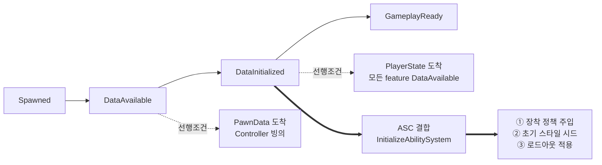

# AstralBreak

> **로비 → 인스턴스 던전 구조의 1~4인 협동 3인칭 액션 RPG** · Unreal Engine 5.7 / C++

**[개발 중 · 1인 프로젝트]** 현재 리슨 서버 기반으로 동작하며, Dedicated Server로 전환할 때 구조를 갈아엎지 않도록 설계 제약을 유지하며 개발하고 있습니다.

이 문서는 완성된 기능 목록이 아니라 **지금까지 내린 설계 결정과 그 근거**를 정리한 것입니다. 미구현 영역은 [개발 현황](#개발-현황)에 그대로 표시했습니다.

---

## 목차

1. [프로젝트 개요](#프로젝트-개요)
2. [개발 현황](#개발-현황)
3. [개발 환경](#개발-환경)
4. [아키텍처 개요](#아키텍처-개요)
5. [설계 결정](#설계-결정)
6. [AI 에이전트 파이프라인](#ai-에이전트-파이프라인)
7. [로드맵](#로드맵)

---

## 프로젝트 개요

| 항목 | 내용 |
| :--- | :--- |
| **장르** | 1~4인 협동 3인칭 액션 RPG (소울라이크 전투) |
| **게임 구조** | 로비 입장 → 파티 편성·준비 → 인스턴스 던전 입장 → 퀘스트·보스 레이드 |
| **엔진** | Unreal Engine 5.7.4 — 게임플레이 로직은 C++, 블루프린트는 데이터·연출 |
| **네트워크** | 서버 권위 · 리슨 서버 기반 / Dedicated Server 호환 구조 지향 |
| **규모** | 1인 개발 · 런타임 모듈 1개 (C++ 약 14K 라인) |

전투의 축은 **근접 ↔ 원거리 전투 스타일 전환**입니다. 장착한 무기가 사용 가능한 스타일을 결정하고, 활성 스타일이 다시 부여 어빌리티와 무기의 부착 위치(손 / 홀스터)를 결정합니다. 세 요소가 서로를 구속하는 구조라, 이 정합을 어디서 어떻게 유지할지가 초기 설계의 핵심 문제였습니다.

---

## 개발 현황

| 시스템 | 상태 | 비고 |
| :--- | :---: | :--- |
| 로비 · 파티 준비 · 던전 이동 | ✅ | 목적지 선택, 전원 준비 집계, `ServerTravel` |
| 로드아웃 (선택 → 도착지 복원) | ✅ | 3단 소스 폴백, 서버 토폴로지 무관 설계 |
| GAS 전투 — 콤보 · 패링/가드 · 회피 · 질주 | ✅ | 몽타주 밴드 기반 입력 윈도우 / 히트 판정 |
| 전투 스타일 전환 (근접 ↔ 원거리) | ✅ | 장비 정합 · 홀스터 전환 포함 |
| 장비 시스템 (계열 × 변형) | ✅ | FastArray 복제, 어빌리티·스탯 부여/회수 |
| 락온 타게팅 · 카메라 · 타겟 전환 | ✅ | 후보 점수·히스테리시스, 마우스/게임패드 전환 |
| 사망 처리 | ✅ | 상태 기계 + `GA_Death`, 클라 리플레이 |
| 자원 (스태미나 · 표식 · 오의 게이지) | ✅ | 오의 **발동**은 미구현 — 게이지만 동작 |
| 몬스터 · AI | 🔶 | 타겟 더미 + 예고 공격 GA. BT/Perception 미착수 |
| 보스 레이드 · 페이즈 | ⬜ | |
| 리스폰 · 관전 | ⬜ | `HealthComponent`에 훅만 확보 |
| 정식 UI | ⬜ | 현재 디버그 위젯 + exec 콘솔 명령으로 조작 |
| 룬 · 성장 트리 | ⬜ | 속성 노브(`MarkGainMultiplier` 등)만 예약 |
| Dedicated Server | ⬜ | 전환을 막지 않는 구조만 유지 |

✅ 동작 · 🔶 부분 구현 · ⬜ 미착수

### 테스트

월드 의존이 없는 판단 로직은 순수 함수로 분리해 Automation 테스트로 덮었습니다 (`AstralBreak.Targeting`, `AstralBreak.TargetSwitchInput`). 후보 점수·히스테리시스 규칙과 마우스/스틱 입력 인식기가 여기 해당합니다. 초기화 체인·로드아웃 폴백처럼 월드가 필요한 경로는 아직 PIE 수동 검증입니다.

---

## 개발 환경

- **Engine** — Unreal Engine 5.7.4 (소스 빌드)
- **Language** — C++17 / Blueprint
- **IDE** — JetBrains Rider
- **Plugins** — GameplayAbilities, EnhancedInput, ModularGameplay, GameFeatures
- **Modules** — AIModule (팀 판정), NetCore, UMG/Slate, DeveloperSettings
- **VCS** — Git + LFS
- **자동화** — Python (UE Remote Execution) + Claude Code

---

## 아키텍처 개요

Lyra의 초기화·모듈 분리 패턴을 참고하되, 필요한 것만 가져왔습니다 (Experience 시스템은 미도입).

| 레이어 | 구성 | 책임 |
| :--- | :--- | :--- |
| **전역** | `AstralGameInstance` · `AstralAssetManager` · `AstralGameData` · `AstralPartySubsystem` | 전역 GE 참조 단일 소유, 서버 세션 캐시 |
| **문맥(월드)** | `AstralGameMode` → `AstralGameState` / `AstralHubGameState` | "이 맵에서 무엇이 허용되는가" |
| **플레이어** | `PlayerController` · `PlayerState`(ASC 소유) · `LocalPlayer` | 로비 RPC, 로드아웃 원본 보관 |
| **폰 (공통)** | `AstralCharacter` + PawnExtension · Health · Equipment | ASC 출처와 무관한 결합·사망 처리 단일 경로 |
| **폰 (히어로)** | `AstralCharacter_Hero` + Loadout · Hero · Targeting · Camera | ASC는 PlayerState에서 빌림, InitState 체인으로 대기 |
| **폰 (적)** | `AstralCombatCharacter` (자체 ASC) | PostInitializeComponents에서 즉시 결합, 대기 없음 |
| **GAS** | ASC · AbilitySet · AttributeSet 4종 · `CombatStatics` · `AbilityTask_AttackTraceWindows` | 팀 판정 · 방어 해석 · 데미지 적용 |
| **장비** | `ItemDefinition` → `WeaponDefinition` / `EquipmentFamily` / `EquipmentInstance` / `WeaponActor` | 계열 × 변형 2축 |

### 폰 초기화 순서

히어로는 ASC를 `PlayerState`에서 빌려 쓰기 때문에, 폰·컨트롤러·PlayerState의 도착 순서가 머신마다 다릅니다. `IGameFrameworkInitStateInterface` 체인으로 각 컴포넌트가 자기 선행 조건을 선언하고, 조건이 갖춰질 때까지 스스로 대기합니다.



`①→②→③` 순서는 뒤바뀌면 안 됩니다. 정책이 없으면 로비에서 무기가 손에 들리고, 스타일 시드가 장착보다 늦으면 첫 프레임에 무기가 홀스터로 갔다가 손으로 튑니다. 이 순서를 델리게이트 등록 순서에 맡기지 않기 위해, `LoadoutComponent`는 자가 구독하지 않고 **소유 폰이 명시적으로 호출**합니다.

> [`AstralCharacter.cpp`](Source/AstralBreak/Character/AstralCharacter.cpp) · [`AstralPawnExtensionComponent.cpp`](Source/AstralBreak/Character/Components/AstralPawnExtensionComponent.cpp)

### 반복되는 원칙 — 상태마다 쓰기 경로는 하나

아래 설계 결정 전체를 관통하는 규칙입니다. 상태를 바꾸는 지점을 하나로 좁히고, 그 지점이 부수 규칙(검증·연쇄 리셋·통지)까지 함께 책임집니다.

| 상태 | 유일한 쓰기 지점 | 그 지점이 함께 책임지는 것 |
| :--- | :--- | :--- |
| 전투 스타일 | `ASC::SetCombatStyle()` | 부모 태그 검증 · 기존 스타일 일괄 해제 |
| 락온 타겟 | `TargetingComponent::CommitTargetingState()` | LOS 유예·검사 주기 리셋 · 구독자 통지 |
| 장비 부여 | `FAstralEquipmentList::AddEntry()` | 문맥 정책(`Full`) 게이트 |

---

## 설계 결정

### 1. 장비 — 계열(Family) × 변형(Definition) 2축

**문제.** 무기 한 종류를 추가할 때마다 스폰할 액터, 부착 소켓, 파지 자세, 부여 어빌리티, 메시, 스탯을 전부 다시 정의해야 했습니다. "낫 A"와 "낫 B"는 메시와 수치만 다른데 나머지가 통째로 복제됐습니다.

**선택지.**
- (A) 무기 정의 하나에 전부 담기 → 변형이 늘수록 중복 폭발
- (B) 상속으로 해결 → "낫 계열이면서 원거리"처럼 축이 교차하면 무너짐
- (C) **재사용 축과 변형 축을 데이터로 분리**

**선택 — (C).**

| | 담는 것 | 개수 |
| :--- | :--- | :--- |
| `EquipmentFamily` | 스폰 액터 · 소켓 · 파지/수납 자세 · 부여 어빌리티 · 소속 전투 스타일 | 계열당 1개 |
| `ItemDefinition` 파생 | 메시 · 자세 보정 · 스탯 세트 · (원거리면) 투사체 | 변형당 1개 |

장비 매니저는 **장비의 종류를 모릅니다.** `FPrimaryAssetId` → `ItemDefinition`(베이스)으로만 해석하고, 종류별 데이터는 스폰된 액터가 정의에서 스스로 꺼내 갑니다(pull). 그 결과 새 장비 종류 추가 비용이 **정의 파생 + 액터 파생 + ini 스캔 룰 1줄**로 고정되고, 매니저는 무변경입니다.

전투 스타일 태그를 변형이 아니라 **계열**에 둔 것도 같은 이유입니다. 스타일이 게이트하는 대상은 계열이 부여하는 어빌리티인데, 변형에 두면 "낫 변형인데 Ranged 선언" 같은 불일치가 표현 가능해집니다.

> [`AstralEquipmentFamily.h`](Source/AstralBreak/Equipment/AstralEquipmentFamily.h) · [`AstralEquipmentManagerComponent.cpp`](Source/AstralBreak/Equipment/AstralEquipmentManagerComponent.cpp)

---

### 2. 문맥 정책의 소유자는 GameState

**문제.** 같은 히어로가 로비에서는 무기를 등에 메고 전투를 못 해야 하고, 던전에서는 손에 들고 어빌리티를 받아야 합니다. 처음엔 이 차이를 `PawnData`에 넣었습니다.

그러자 **히어로 × 문맥의 곱집합**이 생겼습니다. 히어로 3종 × 문맥(로비/던전) 2종 = 데이터 애셋 6개. 히어로를 하나 추가할 때마다 2개씩 늘고, 로비 정책을 바꾸면 전부 손봐야 합니다.

**선택 —** 장착 정책을 히어로 축에서 떼어내 **월드 속성으로 승격**했습니다.

```
AAstralGameState.EquipmentPolicy  =  None | VisualOnly | Full
```

Hub GameMode는 `VisualOnly`(액터만 스폰, 어빌리티·스탯 부여 없음), Raid GameMode는 `Full`을 갖는 GameState 클래스를 지정합니다. `PawnData`에는 히어로 축만 남아 곱집합이 해소됐습니다.

정책의 **실차단 지점은 한 곳**입니다 — `FAstralEquipmentList::AddEntry`가 `Full`일 때만 어빌리티/스탯을 부여합니다. "로비에서 전투 불가"가 여러 곳에 흩어진 조건문이 아니라 단일 게이트로 표현됩니다.

> [`AstralEquipmentTypes.h`](Source/AstralBreak/Equipment/AstralEquipmentTypes.h) · [`AstralGameState.h`](Source/AstralBreak/GameModes/AstralGameState.h)

---

### 3. 로드아웃 — 서버 토폴로지에 무관한 전달

**문제.** 로비에서 고른 캐릭터·무기를 던전에 가져가야 합니다. 지금은 리슨 서버라 `ServerTravel` 한 번이면 되지만, **인스턴스 던전을 별도 서버 프로세스로 띄우는 순간 travel이 아니라 재접속**이 됩니다. 그때 선택 정보가 사라지면 안 됩니다.

**선택 —** 선택의 **원본을 클라이언트 영속 객체에 두고**, 서버에는 명시적으로 전송합니다. 서버는 도착지에서 3단 소스로 복원합니다.

원본은 `UAstralLocalPlayer::CachedLoadout` 입니다. `LocalPlayer`는 `GameInstance`가 소유하므로 **PlayerController·PlayerState 교체, 맵 이동, 다른 서버 재접속을 모두 넘어 유지**됩니다. 서버가 아니라 클라이언트가 원본을 쥐고 있다는 점이 이 설계의 전제입니다.

```
[클라] LocalPlayer.CachedLoadout
          │  PlayerController::BeginPlayingState
          │  └─ ServerSetLoadout RPC (도착한 서버가 어디든 무조건 발신)
          ▼
[서버] ID 해석 검증 ─┬─▶ PlayerState.Loadout      (1순위 소스)
                     └─▶ PartySubsystem 세션 캐시  (2순위 소스)
```

| 순위 | 소스 | 언제 쓰이나 |
| :---: | :--- | :--- |
| 1 | `PlayerState.Loadout` | 정상 경로. 위 재발신 RPC가 채움 |
| 2 | `PartySubsystem` 세션 캐시 | 같은 프로세스 travel 직후, PS가 아직 빈 창 |
| 3 | `PawnData.DefaultEquipment` | 로비를 거치지 않는 단독 테스트 맵 (Full 정책 전용) |

**순서가 중요합니다.** 캐시를 1순위에 두면 "PS 갱신 → 재적용 → 아직 갱신 안 된 캐시 조회"로 던전 중 로드아웃 변경이 이전 값으로 되돌아갑니다. 캐시의 존재 이유는 travel 직후의 빈 창을 메우는 것이므로 2순위가 맞습니다.

별도 인스턴스 서버로 가면 2단 캐시는 비어 있고, 클라 재발신 RPC가 1단을 채웁니다 — **캐시 미스는 장애가 아니라 설계상 정상 경로**입니다. 즉 Dedicated Server 전환 시 교체 대상은 travel 경로 하나뿐이고, 로드아웃 전달 계층은 그대로 살아남습니다.

**RPC가 폰 스폰보다 늦게 도착하는 경우**는 `PlayerState::OnLoadoutChanged` 구독이 받아 재적용합니다. 이때 현재 장착과 동일하면 통째로 건너뛰므로(`MatchesEquippedItems`), 정상 도착 경로에서 무기 액터가 매번 Destroy/Respawn 되어 클라에 복제되거나 진행 중인 어빌리티가 취소되는 일이 없습니다.

> [`AstralPlayerLoadout.h`](Source/AstralBreak/Player/AstralPlayerLoadout.h) · [`AstralLoadoutComponent.cpp`](Source/AstralBreak/Character/Components/AstralLoadoutComponent.cpp) · [`AstralPartySubsystem.h`](Source/AstralBreak/System/AstralPartySubsystem.h)

---

### 4. 전투 스타일과 장비의 정합

**문제.** 스타일 전환은 세 가지를 동시에 건드립니다 — 사용 가능한 어빌리티, 무기 부착 위치(손/홀스터), 애니메이션 세트. 여기에 "총만 든 로드아웃으로 근접 스타일에 진입" 같은 모순 상태를 막아야 합니다.

**선택 — 상태는 ASC가 소유하고, 쓰기 경로를 하나로 좁혔습니다.**

- **읽기** — `ASC::GetCombatStyle()` (보유 중인 `State.CombatStyle.*` 자식 태그)
- **쓰기** — `ASC::SetCombatStyle()` **단 하나**. 부모 태그 검증 + 기존 스타일 일괄 해제
- **정책 해석** — `CombatStatics::ApplyCombatStyle()` 이 장비 조건으로 걸러 `SetCombatStyle`에 넘김

장비 매니저는 **무상태**입니다. 부착 상태를 자기가 기억하지 않고, ASC의 스타일 태그 변경을 구독해 그때그때 `정책 × 스타일` 결정표로 산출합니다.

|  | 활성 스타일 | 비활성 스타일 |
| :--- | :---: | :---: |
| `Full` | **Held** (손) | Holstered |
| `VisualOnly` | Holstered | Holstered |

구독은 부모 태그(`State.CombatStyle`)에 겁니다. 엔진이 태그 변경 시 `GetGameplayTagParents()`를 순회하며 부모 등록 델리게이트를 발동하므로, 자식 스타일이 몇 개로 늘어나든 코드는 그대로입니다. 이벤트 타입은 `AnyCountChange` — `NewOrRemoved`는 "해제 → 설정"이라는 쓰기 순서에 우연히 의존합니다.

그리고 **폴백과 순환은 다른 규칙**이라 분리했습니다.
- `ResolveStyleWithEquipment()` — 폴백. "원하는 스타일 장비가 없으면 있는 쪽으로"
- 전환 GA의 사이클 필터 — 순환. "다음 **유효** 후보로", 유효 후보가 없으면 no-op

둘을 합치면 무기 하나만 든 상태에서 전환 키가 맨손 스타일로 넘어가는 구멍이 생깁니다.

> [`AstralAbilitySystemComponent.cpp`](Source/AstralBreak/AbilitySystem/AstralAbilitySystemComponent.cpp) · [`AstralCombatStatics.cpp`](Source/AstralBreak/AbilitySystem/AstralCombatStatics.cpp) · [`AstralGA_Hero_SwitchCombatStyle.cpp`](Source/AstralBreak/AbilitySystem/Abilities/Hero/Utilities/AstralGA_Hero_SwitchCombatStyle.cpp)

---

### 5. 락온 타게팅 — 반응 속도가 필요한 만큼만 자주

**문제.** 락온에는 성격이 다른 세 가지가 얽혀 있습니다 — **누구를 잡을지**(후보 수집·점수), **언제 놓을지**(거리·시야·사망), **어떻게 보일지**(카메라 추적). 전부 매 프레임 돌리면 후보마다 트레이스가 나가 비싸고, 전부 주기로 돌리면 타겟이 죽은 뒤에도 한동안 락이 남습니다.

**선택 — 하나의 주기로 묶지 않고, 각자 필요한 반응 속도만큼만 돌립니다.**

| 주기 | 하는 일 | 이유 |
| :--- | :--- | :--- |
| 매 프레임 | 타겟 액터 유효성 (약한 참조) | 소멸은 즉시 반응해야 한다 |
| 0.15초 | 유지 조건 — 팀·사망 · 거리 · 시야 유예 | 거리와 시야는 매 프레임 볼 필요가 없다 |
| 락온 입력 시 | 전체 후보 수집 + 점수 | 가장 비싼 작업을 입력 순간에만 |

카메라도 같은 원칙입니다 — 락온 중에만 틱을 켜고, 한 번도 켜지 않은 세션에서는 아예 틱하지 않습니다.

**경계에서 락이 깜빡이는 문제**는 두 축에 각각 히스테리시스를 뒀습니다. 획득 반경(1500)보다 유지 반경(2000)을 넓혀 경계에 선 적이 붙었다 떨어지지 않게 하고, 새 후보는 현재 타겟 점수 + 임계를 넘어야 교체되게 해 비슷한 점수의 두 적 사이에서 진동하지 않게 했습니다.

그리고 **자동 선정과 수동 전환은 다른 규칙**이라 분리했습니다. 플레이어가 스틱을 민 것은 "더 나은 후보로"가 아니라 "저쪽으로"이므로, 점수가 아니라 현재 타겟 기준 **최단 각**으로 고르고 히스테리시스를 적용하지 않습니다.

**판단 로직은 월드에서 떼어냈습니다.** 오버랩·트레이스·팀 판정은 컴포넌트가 맡고, 각도·거리 산술과 히스테리시스 규칙은 `AstralTargeting::` 순수 함수가 맡습니다. 마우스(누적 창)와 게임패드(래치)의 전환 인식기도 같은 이유로 값 타입입니다. 덕분에 선정 규칙과 입력 규칙이 UE 월드 없이 Automation 테스트로 고정됩니다.

시야 판정에는 `AstralTargetLOS` 전용 채널을 두고 Pawn·CharacterMesh를 `Ignore`로 했습니다 — 월드 지오메트리만 시야를 가리므로 다른 적 뒤에 선 적도 잡힙니다. 타게팅·카메라는 로컬 표현이라 복제하지 않습니다. 서버에 타겟을 넘길 필요가 생기면 GAS `TargetData` 경로로 보내 검증하면 됩니다.

> [`AstralTargetingComponent.cpp`](Source/AstralBreak/Character/Hero/Components/AstralTargetingComponent.cpp) · [`AstralTargetingStatics.h`](Source/AstralBreak/Combat/AstralTargetingStatics.h) · [`AstralTargetSwitchInput.cpp`](Source/AstralBreak/Character/Hero/Input/AstralTargetSwitchInput.cpp) · [`AstralHeroCameraComponent.cpp`](Source/AstralBreak/Character/Hero/Components/AstralHeroCameraComponent.cpp)

---

## AI 에이전트 파이프라인

1인 개발의 병목은 코드보다 **에디터 반복 작업**이었습니다. 블루프린트 하나를 만들려면 에디터를 켜고, 부모 클래스를 고르고, 컴포넌트를 붙이고, CDO 값을 하나씩 채워야 합니다.

문제는 이 작업의 결과가 텍스트가 아니라 **바이너리 애셋(`.uasset`, `.umap`)** 에 남는다는 점입니다. AI 코딩 에이전트는 파일을 읽고 고치는 방식으로 동작하는데, 바이너리는 읽을 수도 고칠 수도 없습니다. 그래서 접근을 뒤집었습니다 — **파일을 편집하는 대신, 실행 중인 에디터에 명령을 보냅니다.**

### 1. 원격 실행 브릿지

UE의 Python Remote Execution(UDP 멀티캐스트)으로 에디터 노드를 찾아 스크립트를 넘기고, 출력과 성공 여부를 되받습니다.

```
[에이전트]  Tools/scripts/*.py 작성
     │
     │  python Tools/ue_exec.py <script>
     ▼
[브릿지]   에디터 노드 탐색 → 커맨드 연결 → 원격 실행
     ▼
[에디터]   unreal 모듈로 애셋 생성·수정 → 로그와 결과 반환
     │
     └────▶ [에이전트] 실패 원인을 텍스트로 읽고 수정 후 재시도
```

핵심은 **마지막 화살표**입니다. 결과가 텍스트로 돌아오므로 에이전트가 스스로 오류를 읽고 고칠 수 있습니다. 사람이 에디터 로그 창을 보고 옮겨 적어줄 필요가 없습니다.

### 2. 저작 헬퍼

에디터 안에서 실행되는 쪽은 작업 종류별로 모듈화했습니다.

| 모듈 | 하는 일 |
| :--- | :--- |
| `ab_blueprint.py` | BP 애셋 생성, 컴포넌트 계층 구성, CDO 기본값 설정 |
| `ab_level.py` | JSON 레이아웃 → 레벨 블록아웃 액터 배치 (파라미터 기반 재생성) |
| `ab_montage.py` | 몽타주 생성 + Notify 배치 (히트 윈도우, `GameplayEvent` 태그) |
| `ab_assets.py` | 애셋 카탈로그 덤프 |

### 3. 레벨은 코드가 아니라 데이터

`.umap`은 바이너리라 diff가 되지 않습니다. 아레나를 조금 넓힌 커밋과 스폰을 하나 옮긴 커밋이 히스토리에서 구분되지 않습니다.

그래서 레벨의 **기준 데이터를 `Tools/data/*.layout.json`에 두고**, 맵은 거기서 재생성되는 산출물로 취급했습니다.

```jsonc
{
  "map": ".../L_RaidArena_Test",
  "mode": "rebuild",
  "actors": [
    { "kind": "mesh",  "shape": "cylinder", "label": "SM_Arena_Floor",
      "location": [0, 0, -25], "scale": [44, 44, 0.5] },

    { "kind": "mesh",  "label": "SM_Cover_Pillar",
      "pattern": { "type": "radial", "count": 12, "radius": 1515 } },

    { "kind": "class", "class": "PlayerStart",
      "pattern": { "type": "radial", "count": 4, "radius": 1950,
                   "face_center": true } }
  ]
}
```

기둥을 12개에서 8개로 바꾸거나 반지름을 조정하는 일이 **에디터에서 액터를 옮기는 작업이 아니라 숫자 한 개를 고치는 작업**이 됩니다. 그리고 그 변경이 커밋 diff에 그대로 남습니다.

### 4. Skill — 검증한 제약을 규칙으로 고정

AI가 UE Python API를 쓸 때 가장 흔한 실패는 **그럴듯하지만 존재하지 않는 API 호출**입니다. 문서에 없는 함수명을 자연스럽게 지어내고, 실행해봐야 틀린 걸 압니다.

한 번 실행해서 확인한 제약과 절차를 `.claude/skills/` 3종(BP · 레벨 · 몽타주)에 규칙으로 적어뒀습니다. 같은 시행착오를 반복하지 않기 위한 것입니다.

- 에디터가 파이썬 모듈을 캐시하므로 `importlib.reload()`가 필수
- 메시 경로는 `asset_catalog.json`에 실재하는 것만 — 없는 경로를 지어내지 않는다
- JSON은 `encoding="utf-8-sig"`로 읽는다
- 일괄 수정(`batch_set_defaults`)은 기본이 dry run

### 5. Hook — 권한 경계

에이전트가 셸을 쓰는 이상 경계가 필요합니다. `PreToolUse` 훅으로 Bash 명령을 검사해서 **읽기 전용이 확실한 것만 자동 승인**하고, 나머지는 전부 사람에게 묻습니다.

| | |
| :--- | :--- |
| **자동 승인** | `ls` `cat` `grep` `find` 등 + 읽기 전용 git 서브커맨드 |
| **차단** | 엔진 소스 편집 · 셸 삭제(`rm`/`del`) · `git push --force` · `git reset --hard` |
| **프로젝트 코드** | 수정 허용 — 여기가 작업 대상이므로 |

설계에서 신경 쓴 지점은 **래퍼 명령**입니다. `xargs`나 `env`처럼 뒤에 오는 명령을 대신 실행하는 것들을 화이트리스트에 그냥 넣으면 `env rm -rf`로 전부 무력화됩니다. 그래서 래퍼는 벗겨낸 뒤 **안쪽 명령을 재귀 검증**하고, 조금이라도 애매하면 승인하지 않고 사람에게 넘깁니다(fail-safe).

> [`Tools/ue_exec.py`](Tools/ue_exec.py) · [`Tools/lib/`](Tools/lib) · [`Tools/data/`](Tools/data) · [`.claude/skills/`](.claude/skills) · [`.claude/hooks/allow_readonly.py`](.claude/hooks/allow_readonly.py)

---

## 로드맵

| 단계 | 내용 |
| :--- | :--- |
| **다음** | 몬스터 AI (BT + Perception), 오의 발동, 정식 인게임 UI |
| **이후** | 보스 레이드 페이즈, 리스폰·관전, 룬/성장 트리 |
| **장기** | Dedicated Server 전환 — 인스턴스 던전 서버 분리, 매치메이킹 |

---

## 저장소 구조

```
Source/AstralBreak/
├── AbilitySystem/     ASC · AbilitySet · AttributeSet · Ability · Task · Execution
├── Animation/         AnimInstance · GameplayEvent Notify
├── Character/         AstralCharacter · PawnData · Components
│   ├── Hero/          Hero · Loadout · Targeting · Camera 컴포넌트 + 입력 인식기
│   └── Enemy/         CombatCharacter (자체 ASC)
├── Combat/            TargetHandle · TargetingStatics(순수 함수) · Projectile
├── Equipment/         Family · Definition · Instance · Actor · Manager
├── GameModes/         GameMode · GameState · HubGameState
├── Input/             InputConfig · InputComponent
├── Player/            PlayerController · PlayerState · LocalPlayer · Loadout
├── System/            GameInstance · AssetManager · GameData · PartySubsystem
├── Tests/             Automation 테스트 (순수 함수)
└── UI/Debug/          디버그 위젯

Tools/
├── ue_exec.py         원격 실행 브릿지
├── lib/               에디터 측 저작 헬퍼
├── data/              레벨 layout.json · 애셋 카탈로그
└── scripts/           상설 실행 스크립트 (빌드 · 덤프 · 검증)
    └── setup/         기능 도입 시 1회 실행 → 이후 재현·검증용으로 보존

.claude/
├── skills/            저작 워크플로 스킬 3종 (BP · 레벨 · 몽타주)
├── hooks/             PreToolUse 권한 훅
└── settings.json      권한 허용/차단 규칙
```
