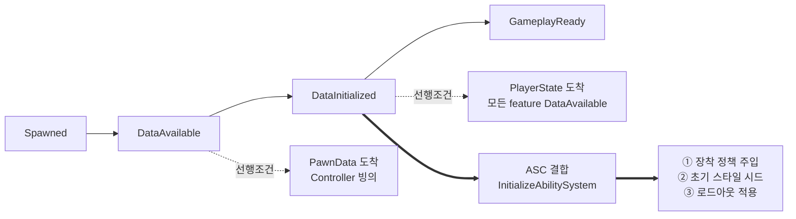

# AstralBreak

> **로비 → 인스턴스 던전 구조의 1~4인 협동 3인칭 액션 RPG** · Unreal Engine 5.7 / C++

**[개발 중 · 1인 프로젝트]** 현재 리슨 서버 기반으로 동작하며, Dedicated Server로 전환할 때 구조를 갈아엎지 않도록 설계 제약을 유지하며 개발하고 있습니다.

이 문서는 완성된 기능 목록이 아니라 **지금까지 내린 설계 결정과 그 근거**를 정리한 것입니다. 미구현 영역은 [개발 현황](#개발-현황)에 그대로 표시했습니다.

---

## 목차

1. [프로젝트 개요](#프로젝트-개요)
2. [개발 현황](#개발-현황)
3. [개발 환경](#개발-환경)
4. [아키텍처 개요](#아키텍처-개요)
5. [설계 결정](#설계-결정)
6. [에디터 자동화](#에디터-자동화)
7. [로드맵](#로드맵)

---

## 프로젝트 개요

| 항목 | 내용 |
| :--- | :--- |
| **장르** | 1~4인 협동 3인칭 액션 RPG (소울라이크 전투) |
| **게임 구조** | 로비 입장 → 파티 편성·준비 → 인스턴스 던전 입장 → 퀘스트·보스 레이드 |
| **엔진** | Unreal Engine 5.7.4 — 게임플레이 로직은 C++, 블루프린트는 데이터·연출 |
| **네트워크** | 서버 권위 · 리슨 서버 기반 / Dedicated Server 호환 구조 지향 |
| **규모** | 1인 개발 |

전투의 축은 **근접 ↔ 원거리 전투 스타일 전환**입니다. 장착한 무기가 사용 가능한 스타일을 결정하고, 활성 스타일이 다시 부여 어빌리티와 무기의 부착 위치(손 / 홀스터)를 결정합니다. 세 요소가 서로를 구속하는 구조라, 이 정합을 어디서 어떻게 유지할지가 초기 설계의 핵심 문제였습니다.

---

## 개발 현황

| 시스템 | 상태 | 비고 |
| :--- | :---: | :--- |
| 로비 · 파티 준비 · 던전 이동 | ✅ | 목적지 선택, 전원 준비 집계, `ServerTravel` |
| 로드아웃 (캐릭터·장비 선택 → 도착지 복원) | ✅ | 3단 소스 폴백, 서버 토폴로지 무관 설계 |
| GAS 전투 — 콤보 · 패링/가드 · 회피 · 질주 | ✅ | 몽타주 밴드 기반 입력 윈도우 / 히트 판정 |
| 전투 스타일 전환 (근접 ↔ 원거리) | ✅ | 장비 정합 · 홀스터 전환 포함 |
| 장비 시스템 (계열 × 변형) | ✅ | FastArray 복제, 어빌리티·스탯 부여/회수 |
| 사망 처리 | ✅ | 상태 기계 + `GA_Death`, 클라 리플레이 |
| 자원 (스태미나 · 표식 · 오의 게이지) | ✅ | 오의 **발동**은 미구현 — 게이지만 동작 |
| 몬스터 · AI | 🔶 | 타겟 더미 + 예고 공격 GA. BT/Perception 미착수 |
| 보스 레이드 · 페이즈 | ⬜ | |
| 리스폰 · 관전 | ⬜ | `HealthComponent`에 훅만 확보 |
| 정식 UI | ⬜ | 현재 디버그 위젯 + exec 콘솔 명령으로 조작 |
| 룬 · 성장 트리 | ⬜ | 속성 노브(`MarkGainMultiplier` 등)만 예약 |
| Dedicated Server | ⬜ | 전환을 막지 않는 구조만 유지 |

✅ 동작 · 🔶 부분 구현 · ⬜ 미착수

---

## 개발 환경

- **Engine** — Unreal Engine 5.7.4 (소스 빌드)
- **Language** — C++17 / Blueprint
- **IDE** — JetBrains Rider
- **Plugins** — GameplayAbilities, EnhancedInput, ModularGameplay, GameFeatures
- **Modules** — AIModule (팀 판정), NetCore, UMG/Slate, DeveloperSettings
- **VCS** — Git + LFS

---

## 아키텍처 개요

Lyra의 초기화·모듈 분리 패턴을 참고하되, 필요한 것만 가져왔습니다 (Experience 시스템은 미도입).

| 레이어 | 구성 | 책임 |
| :--- | :--- | :--- |
| **전역** | `AstralGameInstance` · `AstralAssetManager` · `AstralGameData` · `AstralPartySubsystem` | 전역 GE 참조 단일 소유, 서버 세션 캐시 |
| **문맥(월드)** | `AstralGameMode` → `AstralGameState` / `AstralHubGameState` | "이 맵에서 무엇이 허용되는가" |
| **플레이어** | `PlayerController` · `PlayerState`(ASC 소유) · `LocalPlayer` | 로비 RPC, 로드아웃 원본 보관 |
| **폰 (히어로)** | `AstralCharacter` + PawnExtension · Health · Equipment · Loadout · Hero | 폰은 조립만, 지식은 컴포넌트에 |
| **폰 (적)** | `AstralCombatCharacter` (자체 ASC) | InitState 없이 스폰 즉시 완결 초기화 |
| **GAS** | ASC · AbilitySet · AttributeSet 4종 · `CombatStatics` · `AbilityTask_WeaponTrace` | 팀 판정 · 방어 해석 · 데미지 적용 |
| **장비** | `ItemDefinition` → `WeaponDefinition` / `EquipmentFamily` / `EquipmentInstance` / `WeaponActor` | 계열 × 변형 2축 |

### 폰 초기화 순서

히어로는 ASC를 `PlayerState`에서 빌려 쓰기 때문에, 폰·컨트롤러·PlayerState의 도착 순서가 머신마다 다릅니다. `IGameFrameworkInitStateInterface` 체인으로 각 컴포넌트가 자기 선행 조건을 선언하고, 조건이 갖춰질 때까지 스스로 대기합니다.



`①→②→③` 순서는 뒤바뀌면 안 됩니다. 정책이 없으면 로비에서 무기가 손에 들리고, 스타일 시드가 장착보다 늦으면 첫 프레임에 무기가 홀스터로 갔다가 손으로 튑니다. 이 순서를 델리게이트 등록 순서에 맡기지 않기 위해, `LoadoutComponent`는 자가 구독하지 않고 **소유 폰이 명시적으로 호출**합니다.

> [`AstralCharacter.cpp`](Source/AstralBreak/Character/AstralCharacter.cpp) · [`AstralPawnExtensionComponent.cpp`](Source/AstralBreak/Character/Components/AstralPawnExtensionComponent.cpp)

---

## 설계 결정

### 1. 장비 — 계열(Family) × 변형(Definition) 2축

**문제.** 무기 한 종류를 추가할 때마다 스폰할 액터, 부착 소켓, 파지 자세, 부여 어빌리티, 메시, 스탯을 전부 다시 정의해야 했습니다. "낫 A"와 "낫 B"는 메시와 수치만 다른데 나머지가 통째로 복제됐습니다.

**선택지.**
- (A) 무기 정의 하나에 전부 담기 → 변형이 늘수록 중복 폭발
- (B) 상속으로 해결 → "낫 계열이면서 원거리"처럼 축이 교차하면 무너짐
- (C) **재사용 축과 변형 축을 데이터로 분리**

**선택 — (C).**

| | 담는 것 | 개수 |
| :--- | :--- | :--- |
| `EquipmentFamily` | 스폰 액터 · 소켓 · 파지/수납 자세 · 부여 어빌리티 · 소속 전투 스타일 | 계열당 1개 |
| `ItemDefinition` 파생 | 메시 · 자세 보정 · 스탯 세트 · (원거리면) 투사체 | 변형당 1개 |

장비 매니저는 **장비의 종류를 모릅니다.** `FPrimaryAssetId` → `ItemDefinition`(베이스)으로만 해석하고, 종류별 데이터는 스폰된 액터가 정의에서 스스로 꺼내 갑니다(pull). 그 결과 새 장비 종류 추가 비용이 **정의 파생 + 액터 파생 + ini 스캔 룰 1줄**로 고정되고, 매니저는 무변경입니다.

전투 스타일 태그를 변형이 아니라 **계열**에 둔 것도 같은 이유입니다. 스타일이 게이트하는 대상은 계열이 부여하는 어빌리티인데, 변형에 두면 "낫 변형인데 Ranged 선언" 같은 불일치가 표현 가능해집니다.

> [`AstralEquipmentFamily.h`](Source/AstralBreak/Equipment/AstralEquipmentFamily.h) · [`AstralEquipmentManagerComponent.cpp`](Source/AstralBreak/Equipment/AstralEquipmentManagerComponent.cpp)

---

### 2. 문맥 정책의 소유자는 GameState

**문제.** 같은 히어로가 로비에서는 무기를 등에 메고 전투를 못 해야 하고, 던전에서는 손에 들고 어빌리티를 받아야 합니다. 처음엔 이 차이를 `PawnData`에 넣었습니다.

그러자 **히어로 × 문맥의 곱집합**이 생겼습니다. 히어로 3종 × 문맥(로비/던전) 2종 = 데이터 애셋 6개. 히어로를 하나 추가할 때마다 2개씩 늘고, 로비 정책을 바꾸면 전부 손봐야 합니다.

**선택 —** 장착 정책을 히어로 축에서 떼어내 **월드 속성으로 승격**했습니다.

```
AAstralGameState.EquipmentPolicy  =  None | VisualOnly | Full
```

Hub GameMode는 `VisualOnly`(액터만 스폰, 어빌리티·스탯 부여 없음), Raid GameMode는 `Full`을 갖는 GameState 클래스를 지정합니다. `PawnData`에는 히어로 축만 남아 곱집합이 해소됐습니다.

정책의 **실차단 지점은 한 곳**입니다 — `FAstralEquipmentList::AddEntry`가 `Full`일 때만 어빌리티/스탯을 부여합니다. "로비에서 전투 불가"가 여러 곳에 흩어진 조건문이 아니라 단일 게이트로 표현됩니다.

> [`AstralEquipmentTypes.h`](Source/AstralBreak/Equipment/AstralEquipmentTypes.h) · [`AstralGameState.h`](Source/AstralBreak/GameModes/AstralGameState.h)

---

### 3. 로드아웃 — 서버 토폴로지에 무관한 전달

**문제.** 로비에서 고른 캐릭터·무기를 던전에 가져가야 합니다. 지금은 리슨 서버라 `ServerTravel` 한 번이면 되지만, **인스턴스 던전을 별도 서버 프로세스로 띄우는 순간 travel이 아니라 재접속**이 됩니다. 그때 선택 정보가 사라지면 안 됩니다.

**선택 —** 선택의 **원본을 클라이언트 영속 객체에 두고**, 서버에는 명시적으로 전송합니다. 서버는 도착지에서 3단 소스로 복원합니다.

원본은 `UAstralLocalPlayer::CachedLoadout` 입니다. `LocalPlayer`는 `GameInstance`가 소유하므로 **PlayerController·PlayerState 교체, 맵 이동, 다른 서버 재접속을 모두 넘어 유지**됩니다. 서버가 아니라 클라이언트가 원본을 쥐고 있다는 점이 이 설계의 전제입니다.

```
[클라] LocalPlayer.CachedLoadout
          │  PlayerController::BeginPlayingState
          │  └─ ServerSetLoadout RPC (도착한 서버가 어디든 무조건 발신)
          ▼
[서버] ID 해석 검증 ─┬─▶ PlayerState.Loadout      (1순위 소스)
                     └─▶ PartySubsystem 세션 캐시  (2순위 소스)
```

| 순위 | 소스 | 언제 쓰이나 |
| :---: | :--- | :--- |
| 1 | `PlayerState.Loadout` | 정상 경로. 위 재발신 RPC가 채움 |
| 2 | `PartySubsystem` 세션 캐시 | 같은 프로세스 travel 직후, PS가 아직 빈 창 |
| 3 | `PawnData.DefaultEquipment` | 로비를 거치지 않는 단독 테스트 맵 (Full 정책 전용) |

**순서가 중요합니다.** 캐시를 1순위에 두면 "PS 갱신 → 재적용 → 아직 갱신 안 된 캐시 조회"로 던전 중 로드아웃 변경이 이전 값으로 되돌아갑니다. 캐시의 존재 이유는 travel 직후의 빈 창을 메우는 것이므로 2순위가 맞습니다.

별도 인스턴스 서버로 가면 2단 캐시는 비어 있고, 클라 재발신 RPC가 1단을 채웁니다 — **캐시 미스는 장애가 아니라 설계상 정상 경로**입니다. 즉 Dedicated Server 전환 시 교체 대상은 travel 경로 하나뿐이고, 로드아웃 전달 계층은 그대로 살아남습니다.

**RPC가 폰 스폰보다 늦게 도착하는 경우**는 `PlayerState::OnLoadoutChanged` 구독이 받아 재적용합니다. 이때 현재 장착과 동일하면 통째로 건너뛰므로(`MatchesEquippedItems`), 정상 도착 경로에서 무기 액터가 매번 Destroy/Respawn 되어 클라에 복제되거나 진행 중인 어빌리티가 취소되는 일이 없습니다.

> [`AstralPlayerLoadout.h`](Source/AstralBreak/Player/AstralPlayerLoadout.h) · [`AstralLoadoutComponent.cpp`](Source/AstralBreak/Character/Components/AstralLoadoutComponent.cpp) · [`AstralPartySubsystem.h`](Source/AstralBreak/System/AstralPartySubsystem.h)

---

### 4. 전투 스타일과 장비의 정합

**문제.** 스타일 전환은 세 가지를 동시에 건드립니다 — 사용 가능한 어빌리티, 무기 부착 위치(손/홀스터), 애니메이션 세트. 여기에 "총만 든 로드아웃으로 근접 스타일에 진입" 같은 모순 상태를 막아야 합니다.

**선택 — 상태는 ASC가 소유하고, 쓰기 경로를 하나로 좁혔습니다.**

- **읽기** — `ASC::GetCombatStyle()` (보유 중인 `State.CombatStyle.*` 자식 태그)
- **쓰기** — `ASC::SetCombatStyle()` **단 하나**. 부모 태그 검증 + 기존 스타일 일괄 해제
- **정책 해석** — `CombatStatics::ApplyCombatStyle()` 이 장비 조건으로 걸러 `SetCombatStyle`에 넘김

장비 매니저는 **무상태**입니다. 부착 상태를 자기가 기억하지 않고, ASC의 스타일 태그 변경을 구독해 그때그때 `정책 × 스타일` 결정표로 산출합니다.

|  | 활성 스타일 | 비활성 스타일 |
| :--- | :---: | :---: |
| `Full` | **Held** (손) | Holstered |
| `VisualOnly` | Holstered | Holstered |

구독은 부모 태그(`State.CombatStyle`)에 겁니다. 엔진이 태그 변경 시 `GetGameplayTagParents()`를 순회하며 부모 등록 델리게이트를 발동하므로, 자식 스타일이 몇 개로 늘어나든 코드는 그대로입니다. 이벤트 타입은 `AnyCountChange` — `NewOrRemoved`는 "해제 → 설정"이라는 쓰기 순서에 우연히 의존합니다.

그리고 **폴백과 순환은 다른 규칙**이라 분리했습니다.
- `ResolveStyleWithEquipment()` — 폴백. "원하는 스타일 장비가 없으면 있는 쪽으로"
- 전환 GA의 사이클 필터 — 순환. "다음 **유효** 후보로", 유효 후보가 없으면 no-op

둘을 합치면 무기 하나만 든 상태에서 전환 키가 맨손 스타일로 넘어가는 구멍이 생깁니다.

> [`AstralAbilitySystemComponent.cpp`](Source/AstralBreak/AbilitySystem/AstralAbilitySystemComponent.cpp) · [`AstralCombatStatics.cpp`](Source/AstralBreak/AbilitySystem/AstralCombatStatics.cpp) · [`AstralGA_Hero_SwitchCombatStyle.cpp`](Source/AstralBreak/AbilitySystem/Abilities/Hero/Utilities/AstralGA_Hero_SwitchCombatStyle.cpp)

---

## 에디터 자동화

1인 개발에서 반복 작업이 병목이라, 에디터 조작을 Python으로 자동화했습니다. UE의 Python Remote Execution으로 에디터에 명령을 보내는 구조입니다.

| 스크립트 | 하는 일 |
| :--- | :--- |
| `ab_blueprint.py` | BP 애셋 생성, 컴포넌트 계층 구성, CDO 기본값 설정 |
| `ab_level.py` | JSON 레이아웃 정의 → 레벨 블록아웃 액터 배치 (파라미터 기반 재생성) |
| `ab_montage.py` | 몽타주 생성 + Notify 배치 (히트 윈도우, `GameplayEvent` 태그) |
| `ab_assets.py` | 애셋 카탈로그 덤프 |

레벨은 [`Tools/data/*.layout.json`](Tools/data)에 파라미터로 정의해두고 재생성합니다 — 아레나 크기나 스폰 배치를 바꿀 때 에디터에서 액터를 일일이 옮기지 않습니다.

`.claude/skills/`에 이 워크플로를 감싼 스킬 3종(BP / 레벨 / 몽타주)을 두어, 반복 저작을 자연어 요청으로 처리합니다.

---

## 로드맵

| 단계 | 내용 |
| :--- | :--- |
| **다음** | 몬스터 AI (BT + Perception), 오의 발동, 정식 인게임 UI |
| **이후** | 보스 레이드 페이즈, 리스폰·관전, 룬/성장 트리 |
| **장기** | Dedicated Server 전환 — 인스턴스 던전 서버 분리, 매치메이킹 |

---

## 저장소 구조

```
Source/AstralBreak/
├── AbilitySystem/     ASC · AbilitySet · AttributeSet · Ability · Task · Execution
├── Animation/         AnimInstance · GameplayEvent Notify
├── Character/         AstralCharacter · PawnData · Components · Hero · Enemy
├── Combat/            Projectile
├── Equipment/         Family · Definition · Instance · Actor · Manager
├── GameModes/         GameMode · GameState · HubGameState
├── Input/             InputConfig · InputComponent
├── Player/            PlayerController · PlayerState · LocalPlayer · Loadout
├── System/            GameInstance · AssetManager · GameData · PartySubsystem
└── UI/Debug/          디버그 위젯

Tools/                 Python 에디터 자동화
.claude/skills/        저작 워크플로 스킬
```
